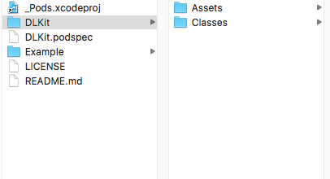

本教程基于 OSX 10.11.6  Pod 1.1.1 版本,边操作边写的教程，中途难免疏漏，有错请留言。
### 流程概述
1.创建两个Git仓库,一个保存podspce,一个保存公共组件代码

2.在~/.cocoapods/repos 下创建私有pod spec

3.测试公共组件代码,打tag提交远程仓库

4.编辑pod spec文件,测试文件是否可用

5.向私有Spec Repo 提交pod spec

6.个人项目中使用制作好的Pod

初次使用CocoaPods请参照  [安装CocoaPods](http://www.jianshu.com/p/ab6575600cf8)

### 建立两个Git仓库

~~~
SpecRepo       Spec Pods仓库   https://github.com/LengYi/SpecRepo.git
DLKit          公共组件代码仓库  https://github.com/LengYi/DLKit.git
~~~

### 创建私有Spec Repo

Spec Repo:所有 Pods 的索引。

~/.cocoapods/repos  目录下有个默认master的官方 Spec Repo.
运行以下命令,将会在 ~/.cocoapods/repos 目录下多一个dlj目录。dli 私有Pod的名称,后一个参数你存储该私有Pod的Git，就是上面创建的SpecRepo Git库。

~~~
mac-mini:~ ice$ pod repo add dlj https://github.com/LengYi/SpecRepo.git
~~~

### 创建Pod项目工程文件

~~~
mac-mini:github ice$ pod lib create DLKit      // 指定创建的目录名称
Cloning `https://github.com/CocoaPods/pod-template.git` into `DLKit`.
Configuring DLKit template.

------------------------------

To get you started we need to ask a few questions, this should only take a minute.

If this is your first time we recommend running through with the guide: 
 - http://guides.cocoapods.org/making/using-pod-lib-create.html
 ( hold cmd and double click links to open in a browser. )

What language do you want to use?? [ Swift / ObjC ]
 > ObjC        // 当前Pod库支持的语言类型

Would you like to include a demo application with your library? [ Yes / No ]
 > YES         // 是否包含一个例子工程 

Which testing frameworks will you use? [ Specta / Kiwi / None ]
 > Specta      // 选择测试框架

Would you like to do view based testing? [ Yes / No ]
 > Yes         // 是否基于View测试

What is your class prefix?
 > DL          // 类的前缀

Running pod install on your new library.

Analyzing dependencies
Fetching podspec for `DLKit` from `../`
Downloading dependencies
Installing DLKit (0.1.0)
Installing Expecta (1.0.5)
Installing Expecta+Snapshots (3.1.1)
Installing FBSnapshotTestCase (2.1.4)
Installing Specta (1.0.6)
Generating Pods project
Integrating client project

[!] Please close any current Xcode sessions and use `DLKit.xcworkspace` for this project from now on.
Sending stats
Pod installation complete! There are 5 dependencies from the Podfile and 5 total pods installed.

 Ace! you're ready to go!
 We will start you off by opening your project in Xcode
  open 'DLKit/Example/DLKit.xcworkspace'

To learn more about the template see `https://github.com/CocoaPods/pod-template.git`.
To learn more about creating a new pod, see `http://guides.cocoapods.org/making/making-a-cocoapod`.
~~~

运行以上工程后会创建一个Xcode工程并会自动打开,调整Xcode工程配置,运行 OK。
创建的内容如下:

### 检查自动生成的DLKit.podspec文件

~~~
mac-mini:DLKit ice$ pod lib lint

 -> DLKit (0.1.0)
    - WARN  | url: The URL (https://github.com/707689817@qq.com/DLKit) is not reachable.

[!] DLKit did not pass validation, due to 1 warning (but you can use `--allow-warnings` to ignore it) and all results apply only to public specs, but you can use `--private` to ignore them if linting the specification for a private pod.
[!] The validator for Swift projects uses Swift 3.0 by default, if you are using a different version of swift you can use a `.swift-version` file to set the version for your Pod. For example to use Swift 2.3, run: 
    `echo "2.3" > .swift-version`.
You can use the `--no-clean` option to inspect any issue.
~~~

解决上述问题:

~~~
mac-mini:DLKit ice$ echo "3.0" > .swift-version
~~~

继续检查DLKit.podspec直到显示如下:

~~~
mac-mini:DLKit ice$ pod lib lint
 -> DLKit (0.1.0)
DLKit passed validation.
~~~

### 编辑DLKit.podspec文件,修改检查出现的错误
原始内容:

~~~
#
# Be sure to run `pod lib lint DLKit.podspec' to ensure this is a
# valid spec before submitting.
#
# Any lines starting with a # are optional, but their use is encouraged
# To learn more about a Podspec see http://guides.cocoapods.org/syntax/podspec.html
#

Pod::Spec.new do |s|
  s.name             = 'DLKit'
  s.version          = '0.1.0'
  s.summary          = 'A short description of DLKit.'    // 需要修改描述，否则会有一个警告

# This description is used to generate tags and improve search results.
#   * Think: What does it do? Why did you write it? What is the focus?
#   * Try to keep it short, snappy and to the point.
#   * Write the description between the DESC delimiters below.
#   * Finally, don't worry about the indent, CocoaPods strips it!

  s.description      = <<-DESC
TODO: Add long description of the pod here.
                       DESC

  s.homepage         = 'https://github.com/707689817@qq.com/DLKit'  // 修改成公共组件代码库的主页,默认生成的有错,没错就不用改了。
  # s.screenshots     = 'www.example.com/screenshots_1', 'www.example.com/screenshots_2'
  s.license          = { :type => 'MIT', :file => 'LICENSE' }
  s.author           = { '707689817@qq.com' => '707689817@qq.com' }
  s.source           = { :git => 'https://github.com/707689817@qq.com/DLKit.git', :tag => s.version.to_s }     // 公共组件代码库的Git地址,Https 的地址,非SSH的地址
  # s.social_media_url = 'https://twitter.com/<TWITTER_USERNAME>'

  s.ios.deployment_target = '8.0'

  s.source_files = 'DLKit/Classes/**/*'
  
  # s.resource_bundles = {
  #   'DLKit' => ['DLKit/Assets/*.png']
  # }

  # s.public_header_files = 'Pod/Classes/**/*.h'
  # s.frameworks = 'UIKit', 'MapKit'
  # s.dependency 'AFNetworking', '~> 2.3'
end
~~~

修改后:

~~~
#
# Be sure to run `pod lib lint DLKit.podspec' to ensure this is a
# valid spec before submitting.
#
# Any lines starting with a # are optional, but their use is encouraged
# To learn more about a Podspec see http://guides.cocoapods.org/syntax/podspec.html
#

Pod::Spec.new do |s|
  s.name             = 'DLKit'
  s.version          = '0.1.0'
  s.summary          = '常用功能库封装'

# This description is used to generate tags and improve search results.
#   * Think: What does it do? Why did you write it? What is the focus?
#   * Try to keep it short, snappy and to the point.
#   * Write the description between the DESC delimiters below.
#   * Finally, don't worry about the indent, CocoaPods strips it!

  s.description      = <<-DESC
TODO: Add long description of the pod here.
                       DESC

  s.homepage         = 'https://github.com/LengYi/DLKit'
  # s.screenshots     = 'www.example.com/screenshots_1', 'www.example.com/screenshots_2'
  s.license          = { :type => 'MIT', :file => 'LICENSE' }
  s.author           = { '707689817@qq.com' => '707689817@qq.com' }
  s.source           = { :git => 'https://github.com/LengYi/DLKit.git', :tag => s.version.to_s }
  # s.social_media_url = 'https://twitter.com/<TWITTER_USERNAME>'

  s.ios.deployment_target = '8.0'

  s.source_files = 'DLKit/Classes/**/*'
  
  # s.resource_bundles = {
  #   'DLKit' => ['DLKit/Assets/*.png']
  # }

  # s.public_header_files = 'Pod/Classes/**/*.h'
  # s.frameworks = 'UIKit', 'MapKit'
  # s.dependency 'AFNetworking', '~> 2.3'
end
~~~

检查验证成功。
### 关联DLKit 到远程公共组件Git 库
默认生成的项目就自带Git,直接关联到远程仓库即可

~~~
git add ./
git commit -m "注释"
git remote add origin https://github.com/LengYi/DLKit.git
git push -u origin master
~~~

### 添加模块组件目录如下

~~~
mac-mini:DLKit ice$ tree Classes -L 5
Classes
└── Base
    ├── App
    │   ├── DLAppInfo.h
    │   └── DLAppInfo.m
    ├── DLNet
    │   └── Request
    │       ├── DLHttp.h
    │       └── DLHttp.m
    └── DLUIKitExtended
        └── Device
            ├── UIDevice+extended.h
            ├── UIDevice+extended.m
            ├── UIDevice+name.h
            └── UIDevice+name.m
~~~

修改DLKit.podspec如下

~~~
#
# Be sure to run `pod lib lint DLKit.podspec' to ensure this is a
# valid spec before submitting.
#
# Any lines starting with a # are optional, but their use is encouraged
# To learn more about a Podspec see http://guides.cocoapods.org/syntax/podspec.html
#

Pod::Spec.new do |s|
  s.name             = 'DLKit'
  s.version          = '0.1.0'
  s.summary          = 'Http请求,获取设备信息,获取App信息'

# This description is used to generate tags and improve search results.
#   * Think: What does it do? Why did you write it? What is the focus?
#   * Try to keep it short, snappy and to the point.
#   * Write the description between the DESC delimiters below.
#   * Finally, don't worry about the indent, CocoaPods strips it!

  s.description      = <<-DESC
TODO: Add long description of the pod here.
                       DESC

  s.homepage         = 'https://github.com/LengYi/DLKit'
  # s.screenshots     = 'www.example.com/screenshots_1', 'www.example.com/screenshots_2'
  s.license          = { :type => 'MIT', :file => 'LICENSE' }
  s.author           = { '707689817@qq.com' => '707689817@qq.com' }
  s.source           = { :git => 'https://github.com/LengYi/DLKit.git', :tag => s.version.to_s }
  # s.social_media_url = 'https://twitter.com/<TWITTER_USERNAME>'

  s.ios.deployment_target = '8.0'

  #s.source_files = 'DLKit/Classes/**/*'
  s.subspec 'DLHttp' do |http|
      http.source_files = 'DLKit/Classes/Base/DLNet/Request/**/*'
  end

  s.subspec 'UIDevice+extended' do |dev|
      dev.source_files = 'DLKit/Classes/Base/DLUIKitExtended/Device/**/*'
  end

  s.subspec 'DLAppInfo' do |info|
    info.source_files = 'DLKit/Classes/Base/App/**/*'
  end

  # s.resource_bundles = {
  #   'DLKit' => ['DLKit/Assets/*.png']
  # }

  # s.public_header_files = 'Pod/Classes/**/*.h'
  s.frameworks = 'UIKit', 'AdSupport','Foundation'
  # s.dependency 'AFNetworking', '~> 2.3'
end

~~~

进入Example 测试工程

~~~
pod update  --no-repo-update
~~~

运行测试工程测试刚添加的模块，检查是否能够正常调用。
注意:每次向Pod添加了新的文件或者更新了 podspec文件内容都需要重新执行一遍 pod update  --no-repo-update 命令。

检查pod spec,直到没有错误，没有警告

~~~
mac-mini:DLKit ice$ pod lib lint
~~~

### 给DLKit公共组件代码模块打发行版本号

~~~
mac-mini:DLKit ice$ git add ./
mac-mini:DLKit ice$ git commit -m "添加Http请求,获取设备信息,获取App信息模块"
mac-mini:DLKit ice$ git tag -m "添加Http请求,获取设备信息,获取App信息模块" 0.1.0         // 该版本号需跟podspec中的版本号一致
mac-mini:DLKit ice$ git push --tags  // 将tag推送到远程服务器
~~~

### 向SpecRepo仓库提交pod spec
注意：如果碰到本地使用 pod lib lint 验证通过,但是下面的操作失败了,请重新生成新的tag版本号并推送到服务器,使用 pod repo push dlj DLKit.podspec --allow-warnings --verbose 查看具体原因

~~~
mac-mini:DLKit ice$ pod repo push dlj DLKit.podspec

Validating spec
 -> DLKit (0.1.0)

Updating the `dlj' repo

Your configuration specifies to merge with the ref 'refs/heads/master'
from the remote, but no such ref was fetched.

Adding the spec to the `dlj' repo

 - [Add] DLKit (0.1.0)

Pushing the `dlj' repo

To https://github.com/LengYi/SpecRepo.git
 * [new branch]      master -> master
~~~

之后到 ~/.cocoapods/repos/dlj 目录查看

~~~
mac-mini:repos ice$ tree dlj -L 3
dlj
└── DLKit
    └── 0.1.0
        └── DLKit.podspec
~~~

以上步骤成功将能搜索到DLKit,结果如下

~~~
-> DLKit (0.1.0)
   Http请求,获取设备信息,获取App信息
   pod 'DLKit', '~> 0.1.0'
   - Homepage: https://github.com/LengYi/DLKit
   - Source:   https://github.com/LengYi/DLKit.git
   - Versions: 0.1.0 [dlj repo]
   - Subspecs:
     - DLKit/DLHttp (0.1.0)
     - DLKit/UIDevice+extended (0.1.0)
     - DLKit/DLAppInfo (0.1.0)
(END)
~~~ 

### 本地测试podspec文件
新建一个测试工程,添加 Podfile 文件

~~~
CocoaPodsDemo
├── CocoaPodsDemo
├── CocoaPodsDemo.xcodeproj
└── Podfile
~~~

直接使用本地DLKit库,一般用于测试podspec是否正常使用 Podfile写法

~~~
platform :ios,'8.0'
target 'CocoaPodsDemo' do
pod 'DLKit',:path => '/Users/ice/Desktop/work/github/DLKit'  // 组件代码Git仓库文件路径
end
~~~

没有推送到CocoaPod 官方源正常使用方法
使用整个DLKit库的Podfile

~~~
source 'https://github.com/CocoaPods/Specs.git'   // 如果有使用到官方库需添加本语句
source 'https://github.com/LengYi/SpecRepo.git'    // pod spec对应的Git库非组件Git库
platform :ios,'8.0'
target 'CocoaPodsDemo' do
pod 'DLKit/UIKit','0.1.0'
end
~~~

执行以下命令，然后在工程中包含需要使用的对应头文件就可以使用封装好的库了。

~~~
pod update  --no-repo-update
~~~

仅使用部分DLKit库的Podfile

~~~
source 'https://github.com/CocoaPods/Specs.git'   // 如果有使用到官方库需添加本语句
source 'https://github.com/LengYi/SpecRepo.git' // pod spec对应的Git库非组件Git库
platform :ios,'8.0'
target 'CocoaPodsDemo' do
pod 'DLKit/DLHttp', '~> 0.1.0'
pod 'DLKit/UIDevice+extended','~> 0.1.0'
end
~~~

### 如何删除一个私有库

~~~
mac-mini:~ ice$ pod repo remove dlj
~~~

以上为创建过程，如果想直接使用封装好的Pod
1.首先本地创建私有Pod

~~~
mac-mini:~ ice$ pod repo add dlj https://github.com/LengYi/SpecRepo.git
~~~

2.具体工程Podfile参照上面写法即可。

### 遇到的问题及解决方法
1.pod lib lint执行报错

~~~
  - ERROR | [iOS] xcodebuild: Returned an unsuccessful exit code. You can use `--verbose` for more information.
    - ERROR | xcodebuild:  ....
    -  error: include of non-modular header inside framework module '' [-Werror,-Wnon-modular-include-in-framework-module]
...
~~~

库的某个头文件中直接import了第三方库（我对它有依赖）的头文件，将它放到  .m中

2.pod lib lint验证成功了，但是pod repo push 的时候提示podspec无法通过验证
重新提交一个新的tag并push，再执行pod repo push，验证通过。

3.pod search可以成功的搜索到自己的库，但是在项目中执行pod install报错

在podfile 文件中添加

~~~
source 'https://github.com/CocoaPods/Specs.git'   // 如果有使用到官方库需添加本语句
source 'https://github.com/LengYi/SpecRepo.git' // pod spec对应的Git库非组件Git库
~~~

4.添加新的类文件到库后 pod lib lint 无法验证通过

~~~
 -> DLKit (0.1.2)
    - ERROR | [iOS] unknown: Encountered an unknown error (757: unexpected token at '2017-04-20 11:23:47.824 simctl[46081:1822584] CoreSimulator is attempting to unload a stale CoreSimulatorService job.  Detected Xcode.app relocation or CoreSimulatorService version change.  Framework path (/Applications/Xcode.app/Contents/Developer/Library/PrivateFrameworks/CoreSimulator.framework) and version (201.3) does not match existing job path (/Users/ice/Desktop/Xcode.app/Contents/Developer/Library/PrivateFrameworks/CoreSimulator.framework/Versions/A/XPCServices/com.apple.CoreSimulator.CoreSimulatorService.xpc/Contents/MacOS/com.apple.CoreSimulator.CoreSimulatorService) and version (338.16).
2017-04-20 11:23:48.833 simctl[46081:1822584] Failed to locate a valid instance of CoreSimulatorService in the bootstrap.  Adding it now.
') during validation.

[!] DLKit did not pass validation, due to 1 error.
You can use the `--no-clean` option to inspect any issue.
~~~

进入Example 工程文件运行

~~~
pod update --no-repo-update
~~~

再次验证即可通过

参考链接：
[CocoaPods 官网](http://guides.cocoapods.org/syntax/podspec.html)