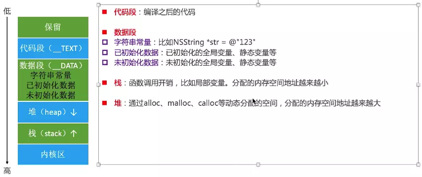

# iOS  内存管理机制

## 内存区域
+ 栈区
+ 堆区
+ 常量区
	+ 未初始化区
	+ 已初始化区 
+ 代码区
+ 保留区

## 内存布局

循环引用

深拷贝和浅拷贝

weak指针的实现原理
 将弱引用存储到一张哈希表中，对象要销毁时，会取出当前对象对应的弱引用表，把弱引用表中的内容给清除掉
 
 自动释放池
 
 autorelease对象在什么时机调用release？
 
内存泄漏检测

https://www.jianshu.com/p/0d7dfb5093a8

黑幕背后的Autorelease 
http://blog.sunnyxx.com/2014/10/15/behind-autorelease/

内存管理->内存模型->内存泄漏检测
app CPU架构-> 如何查看链接库->mach-o结构
证书分发->签名校验流程->iOS授权描述文件内容？->是否能够拦截签名校验的过程

