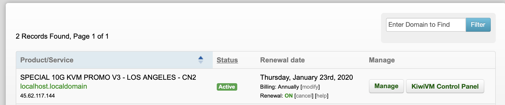
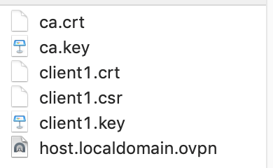
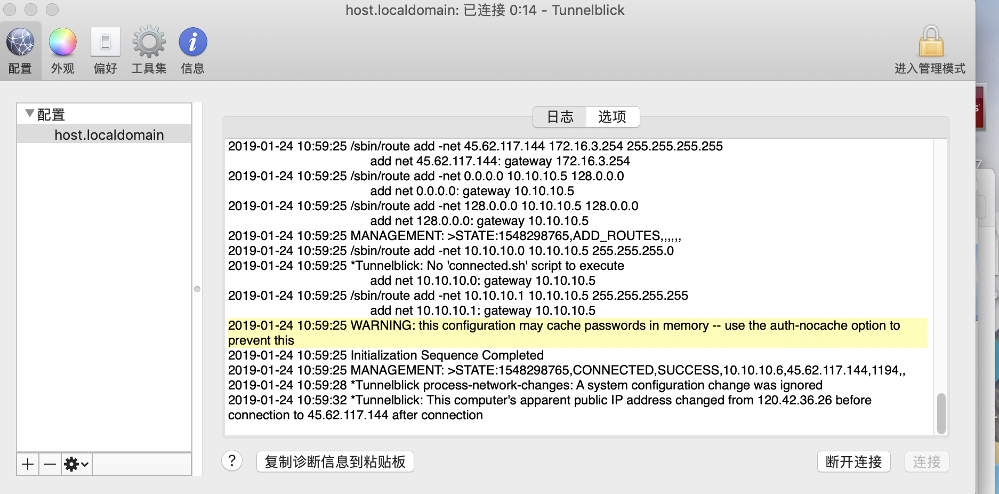

搭建VPN科学上网环境

一 、下载 [蓝灯]() 访问搬瓦工需要vpn

二、 访问 [搬瓦工](https://bandwagonhost.com) 购买VPS服务

三、使用邮箱接收到的信息登录 [控制台](https://kiwivm.64clouds.com)

四、安装 [OpenVPN](https://kiwivm.64clouds.com/main-exec.php?mode=extras_openvpn)

五、等待第三步完成后下载证书文件

六、下载MAC VPN使用工具 [Tunnelblick](https://tunnelblick.net/downloads.html)

将步骤五下载的host.localdomain.ovpn拖动到上图的配置中，然后点击连接就可以开始愉快的翻墙了。