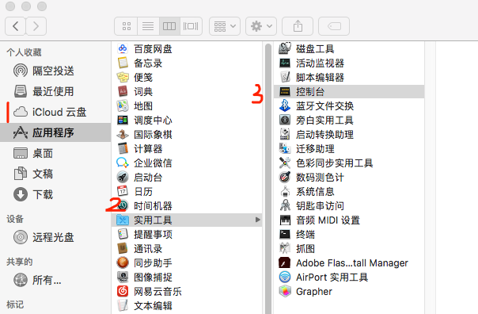
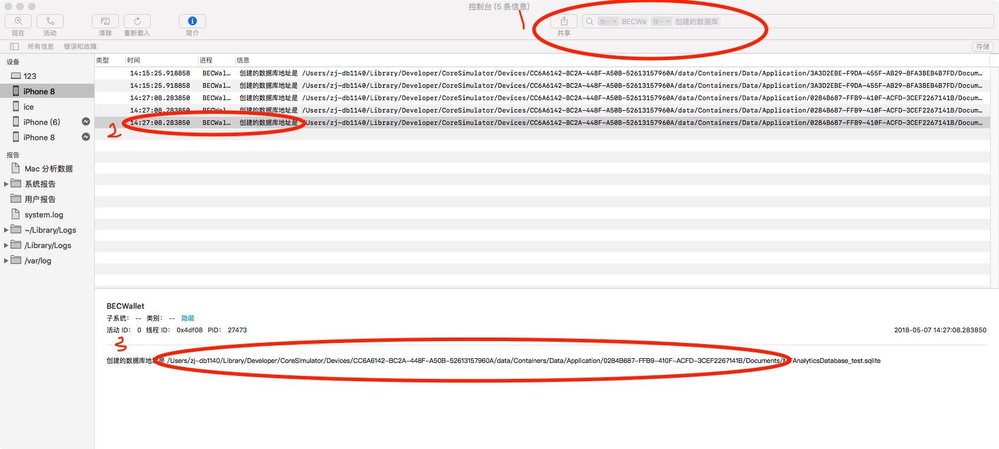

# iOS模拟器安装 App

### 应用场景
+ 非开发人员没有权限接触到源码
+ 证书只在持续集成环境或者Appstore产线里面,不是每个人都能拿到证书
+ 一个证书能够安装的设备数量是有限制的，超过了就无法安装
+ 不是每个人手头上都有iOS设备，或者测试设备有限不方便借到
+ 虽然公司目前有打包机的机制，但是由于设备的限制，并不能方便的比如导入更换h5本地资源包等操作，进行此类配合开发并不便利,鉴于公司大部分同事都使用的Mac Book，该方案具有一定的可执行性。

### 使用步骤
#### 1.[安装xcode](https://itunes.apple.com/cn/app/xcode/id497799835?mt=12)

#### 2.安装ios-sim

打开mac终端  /Applications/Utilities/终端

~~~
npm install ios-sim -g
~~~

如果没有安装npm

~~~
brew install npm
~~~

如果没有 [安装brew](https://brew.sh) 

#### 3.安装包获取 TARGETS->Build Phases->Run Script

~~~
ditto -ck --sequesterRsrc --keepParent `ls -1 -d -t ~/Library/Developer/Xcode/DerivedData/*/Build/Products/*-iphonesimulator/*.app | head -n 1` ~/Desktop/app.zip
~~~

以上命令 由开发人员操作生成安装资源包 
执行结果:拷贝当前编译成功的app到桌面,生成被安装包格式zip，使用者需要先解压再使用。

#### 4.安装App

~~~
ios-sim launch ~/Desktop/BECWallet.app --devicetypeid iPhone-8, 11.2
~~~

+ ~/Desktop/BECWallet.app 被安装app的包路径找开发获取
+ iPhone-8, 11.2 打开的模拟器类型，这里是iphone8 11.2系统
+ iPhone-8, 11.2 可以通过 ios-sim showdevicetypes 打印出列表进行替换

#### 5.查看替换Document下的相关文件

打开 /Applications/Utilities/控制台

获取到Document文件路径

参照1的位置输入查找点击最后一条日志，稍等一会拷贝3的地址，仅拷贝到Document位置

#### 6.导航至Document路径
点击一下桌面，选择前往->前往文件夹，输入刚粘贴的路径

当前H5相关的文件都存放在WebH5Cache下，替换相关的文件即可