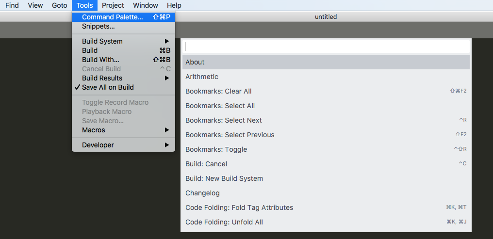
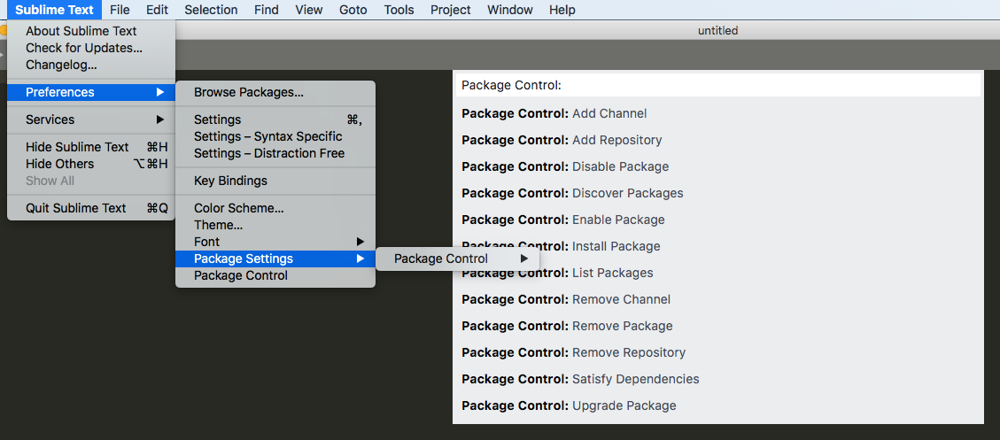
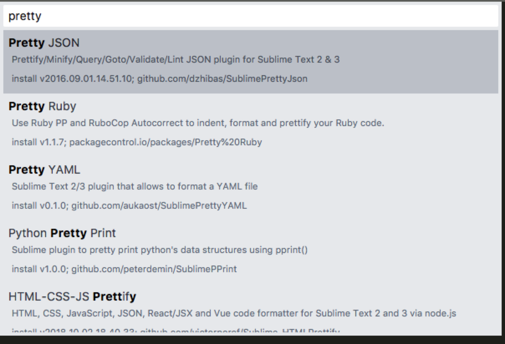

## SublimeText 安装使用教程
### 安装SublimeText
[安装链接](https://www.sublimetext.com)
### 安装Package Control 插件管理工具

+ 打开编辑器，顶部找到Tools -> Command Paletter 菜单如上图所示
+ 再打开的命令行模式输入框中，输入pac，然后回车安装
+ 等待提示安装成功之后，关闭SublimeText重启

### 安装Json格式化工具

+ 菜单栏 sublime Text -> Preference -> Package Control
+ 或者快捷键 command + shift + p
+ 打开如上图所示
+ 输入pci，选中“PackageControl: Install Package”并回车
+ 再弹出的输入框，输入pretty json 搜索插件如下图所示，选中第一行回车或者双击鼠标完成安装

### 使用pretty json插件
+ ctrl + command + j