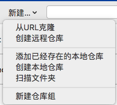
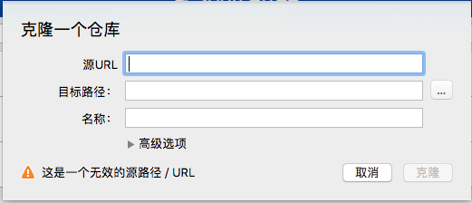
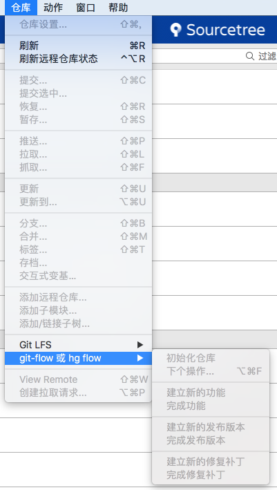
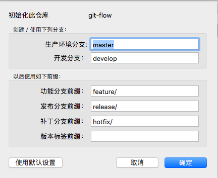
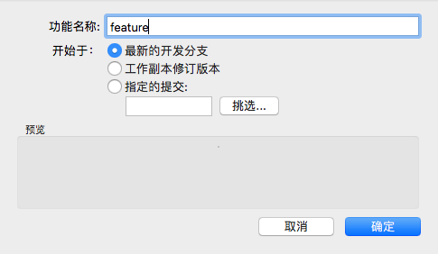
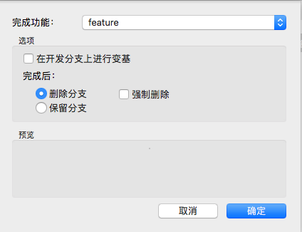

# SourceTree Git-Flow 工作流
## SourceTree是什么
+ 可视化界面项目版本控制软件，适合git项目管理
+ windows、mac都有对应的版本可以使用

## 获取项目代码
1.点击新建

2.选择从URL克隆

3.填写git库地址，选择本地保存路径

4.点击克隆，等待项目克隆完成，完成后左侧只有一个master分支

克隆完成后，得到的是发布后的master源码，如果想要获取最新的正在开发中的源码，需要对项目流进行初始化，点击 仓库->git-flow 或 hg flow-> 初始化仓库
直接点击确定，获取develop分支源码，开发任务都是在develop分支上完成的

5.分支共用5种类型

+ master，最终发布版本，整个项目中有且只有一个
+ develop，项目的开发分支，原则上项目中有且只有一个
+ feature，功能分支，用于开发一个新的功能
+ release，预发布版本，介于develop和master之间的一个版本，主要用于测试
+ hotfix，修复补丁，用于修复master上的bug，直接作用于master

6.当开发中需要增加一个新的功能时，可新建feature分支，用于增加新的功能，并且不影响开发中的develop源码，当新功能玩成后，完成feature分支，将新功能合并到develop中

1）新建feature，选中develop分支 仓库->git-flow 或 hg flow->建立新的功能 输入分支名称确定即建立了一个新的分支

2）在新建的feature分支上开发提交任务，直到本次功能任务完成

3）保持当前选中的是feature分支，仓库->git-flow 或 hg flow->完成功能

如上图所示你可以保留当前开发的分支也可以删除不保留

4）需要再添加新的功能时，重复以上操作即可

5）当开发到一定阶段，可以发布测试版本时，可以从develop分支，建立release分支，进入预发布测试阶段。点击“Git工作流”，选择“建立新的发布版本”

5）其它类别分支操作方法基本同上

[Git 入门到高级](https://backlog.com/git-tutorial/cn/)

[Git 其它工作流](https://github.com/xirong/my-git/blob/master/git-workflow-tutorial.md)
