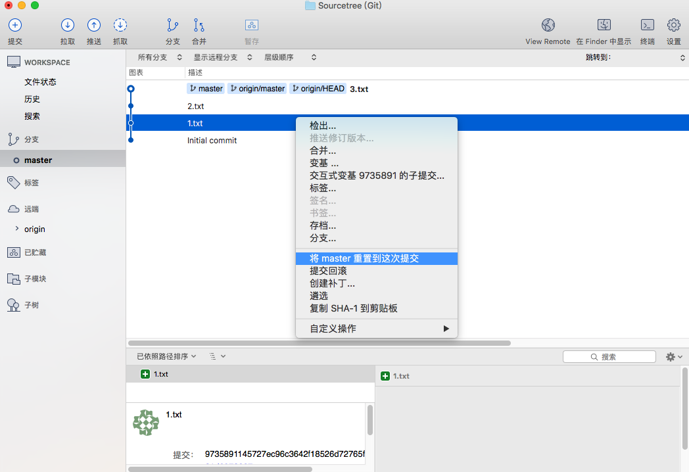
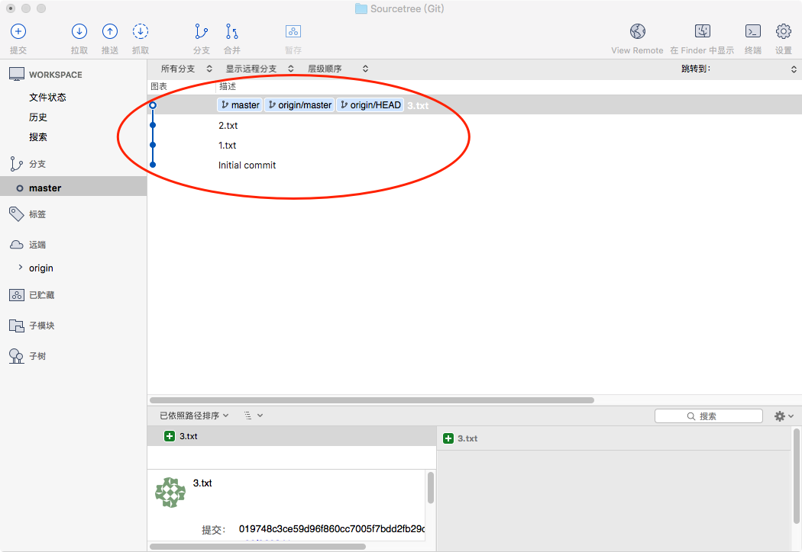
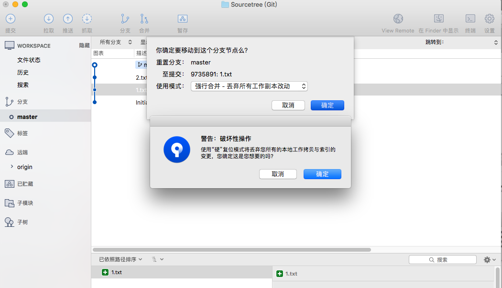
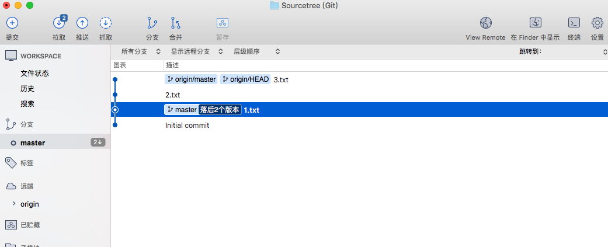
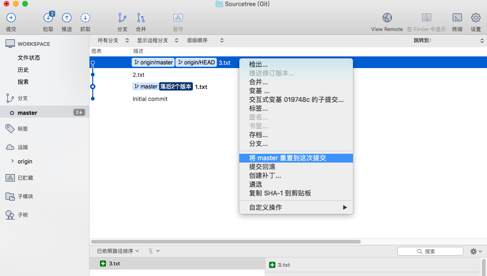
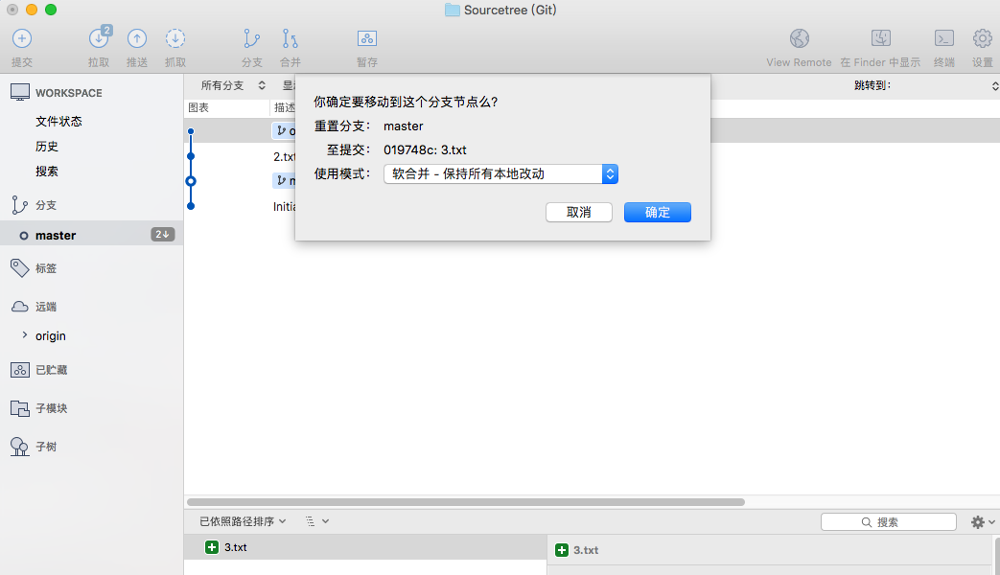
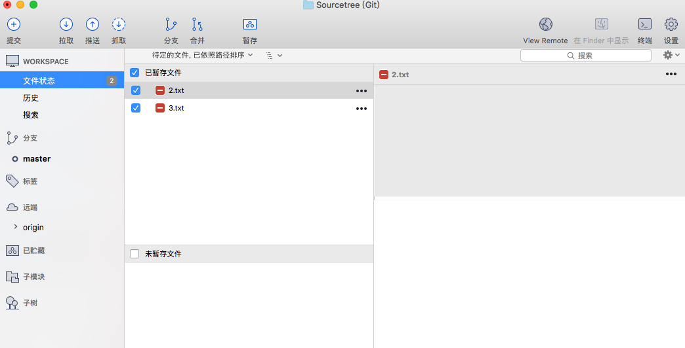
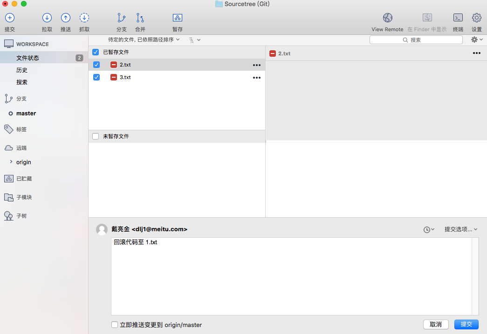

# Git回滚到历史节点

+ 回滚本地提交未提交至远程服务器

选择硬合并,将会直接丢弃之前的提交（慎重，或者使用默认选项之后自己删除未跟踪文件）

+ 回滚远程服务器提交

##需求:
丢弃远程 3.txt 跟 2.txt 的提交回滚至 1.txt提交

##步骤:
1.点击历史节点 1.txt，重置到历史节点

2.选择硬合并

3.操作结果如下

4.点击当前节点 3.txt 重置到当前节点

5.选择软合并

6.操作结果如下

7.提交

至此你成功的丢弃了 2.txt  跟 3.txt 并且更新了远程服务端