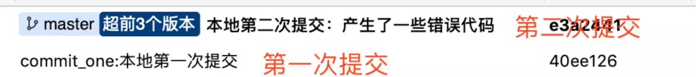
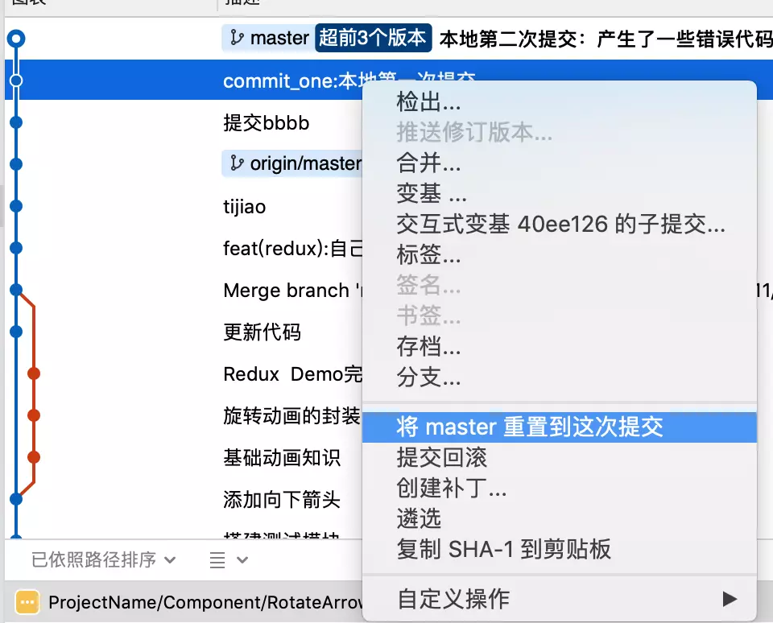
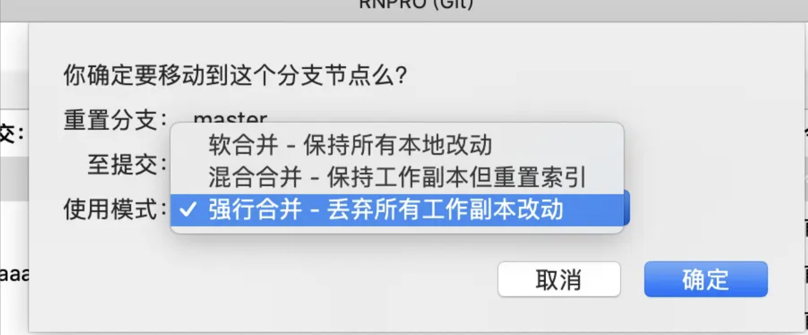
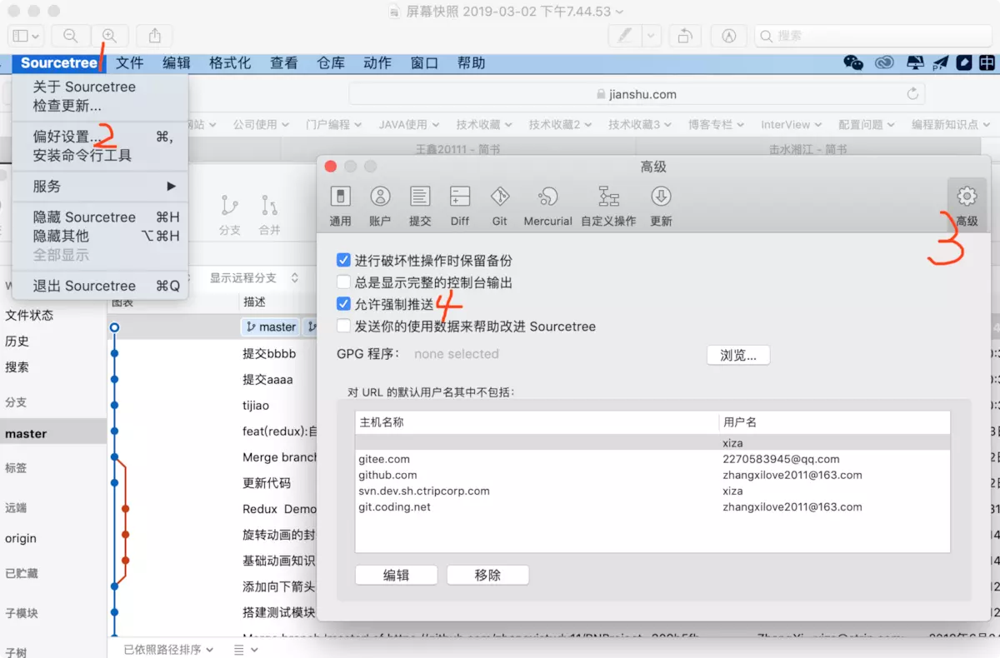

# Git回滚到历史节点

### 一、场景

+ 提交错误代码，想放弃刚提交的部分
+ 代码发生冲突，处理麻烦，为了代码安全，直接回滚到之前干净的代码

### 二、本地回滚

回滚本地提交，代码还未推送至远程仓库

本地提交了两次，丢弃第二次的提交回滚到第一次提交，进行如下操作

选中 “本地第一次提交”，右击->将（所在分支）重置到这次提交->强行合并->确定

请谨慎选择下面的选项

### 三、远程回滚

+ 回滚本地提交未提交至远程服务器

选择硬合并,将会直接丢弃之前的提交（慎重，或者使用默认选项之后自己删除未跟踪文件）

+ 回滚远程服务器提交

##需求:
丢弃远程 3.txt 跟 2.txt 的提交回滚至 1.txt提交

##步骤:
1.点击历史节点 1.txt，重置到历史节点

2.选择硬合并

3.操作结果如下

4.点击当前节点 3.txt 重置到当前节点

5.选择软合并

6.操作结果如下

7.提交

至此你成功的丢弃了 2.txt  跟 3.txt 并且更新了远程服务端

### 四、远程回滚的另一种方式 （危险慎用）

+ SourceTree开启允许强制推送权限

  

+ 操作同本地回滚

+ 直接推送至服务器端