# iTunes降级下载App历史低版本安装包
# 前言
+ 在开发过程中，经常需要参考其他App的实现，需要获取到对应的安装包，进行逆向技术分析，但是目前最新iTunes已经屏蔽了在电脑端下载App的入口。
+ 自己开发上架的App历史版本升级到最新版本发生崩溃，需要复现但是没有保存历史包，需要下载到历史的App

# 流程
+ 下载低版iTunes
+ 删除高版iTunes
+ 关闭iTunes升级
+ 抓包App历史版本包
+ 
Mac支持下载APP的iTuens版本是12.6.2，所以我们要降级iTuens的版本

## 安装环境环境

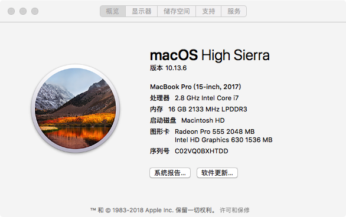

## 下载12.6.2iTunes
[iTunes历史版本](https://support.apple.com/zh_CN/downloads/itunes)

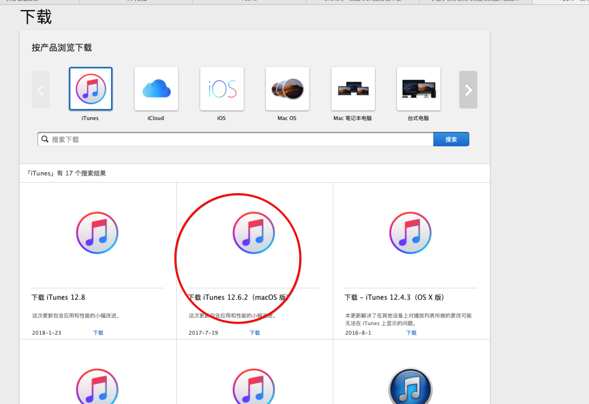

## 删除Mac上最新版本iTunes
直接在应用程序里面移除到废纸楼是无法删除的，会提示没有访问权限

重启电脑，按COMMAND+R组合键进入恢复模式，找到【实用工具】-->【终端】，在终端窗口中输入命令csrutil disable解决权限限制
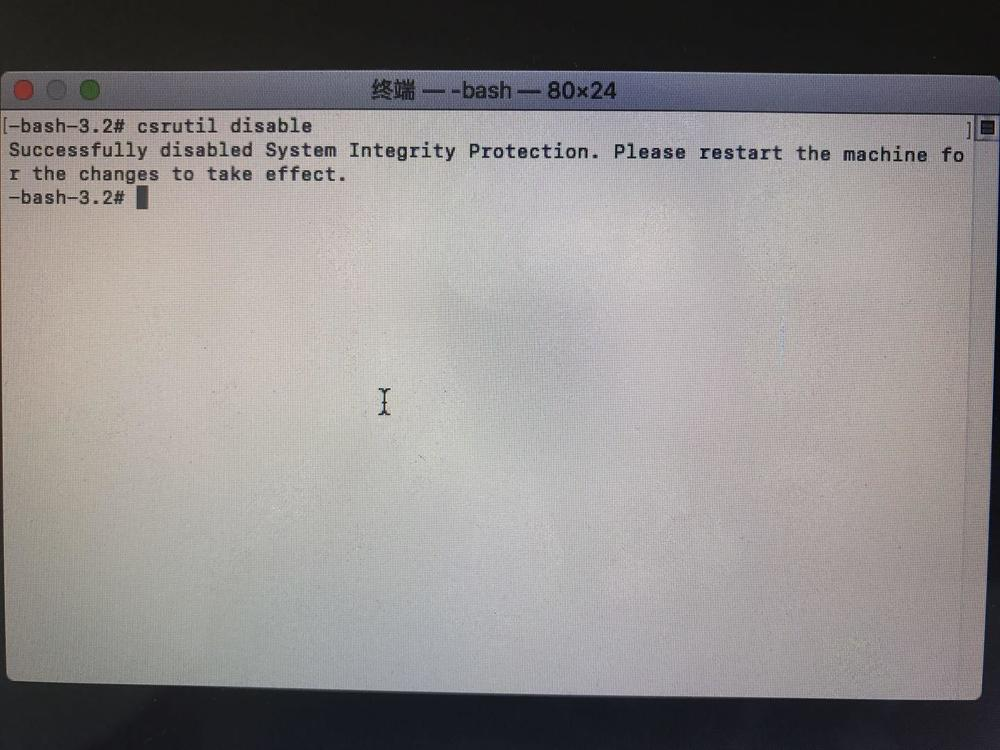 
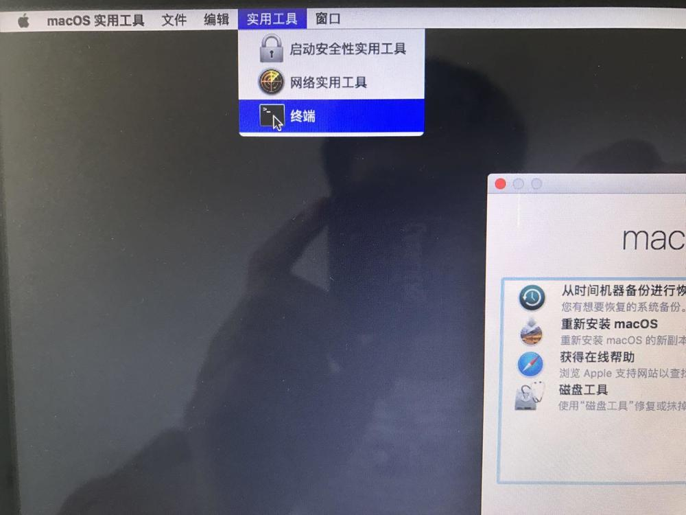 

重启电脑，打开终端,运行以下命令

~~~
cd /Applications/ 
sudo rm -rf iTunes.app
~~~

成功删除iTunes
## 安装12.6.2iTunes
### 问题1
安装完打开提示如下
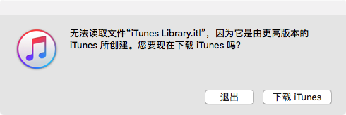 

全局搜索 iTunes Library.itl 然后删除
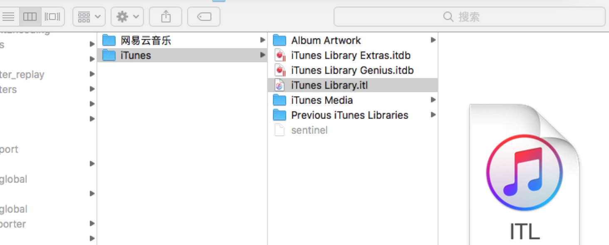 

重新安装12.6.2iTunes

### 问题2
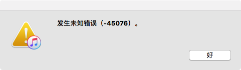 

将以下脚本直接贴到终端运行，然后重装iTunes

~~~
sudo rm -rf /Library/Documentation/Applications/iTunes/Acknowledgements.rtf /Library/Documentation/iPod/Acknowledgements.rtf /Library/Frameworks/iTunesLibrary.framework/ /Applications/iTunes.app/ /System/Library/PrivateFrameworks/iTunesAccess.framework/ /System/Library/LaunchDaemons/com.apple.fpsd.plist /System/Library/PrivateFrameworks/CoreFP.framework/ /System/Library/PrivateFrameworks/CoreADI.framework/ /System/Library/LaunchDaemons/com.apple.adid.plist /System/Library/CoreServices/UAUPlugins/ADIUserAccountUpdater.bundle/ /System/Library/CoreServices/CoreTypes.bundle/Contents/Library/MobileDevices.bundle/ /System/Library/LaunchDaemons/com.apple.usbmuxd.plist /System/Library/PrivateFrameworks/AirTrafficHost.framework/ /System/Library/PrivateFrameworks/DeviceLink.framework/ /System/Library/PrivateFrameworks/MobileDevice.framework/ /System/Library/Extensions/AppleMobileDevice.kext/ /System/Library/Extensions/AppleUsbEthernetHost
~~~

## 关闭iTunes升级
选中iTunes，选择偏好设置
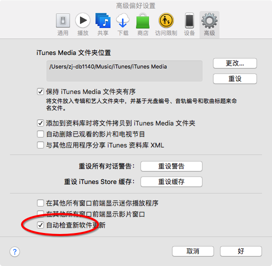 

打开设置->软件更新->高级 取消各种更新

## 恢复 csrutil
参照关闭流程

~~~
csrutil enable
~~~

# 抓包下载App历史版本
设置ssl Help-> SSL Proxying -> Install charles Root Certificate
设置代理到Mac
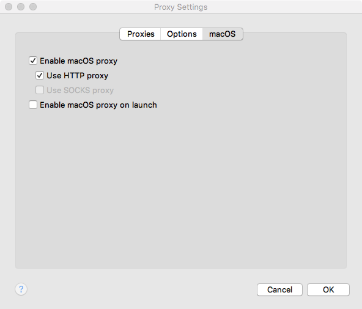 

使用AppleID登录iTunes 搜索需要下载的App，这里以QQ为列
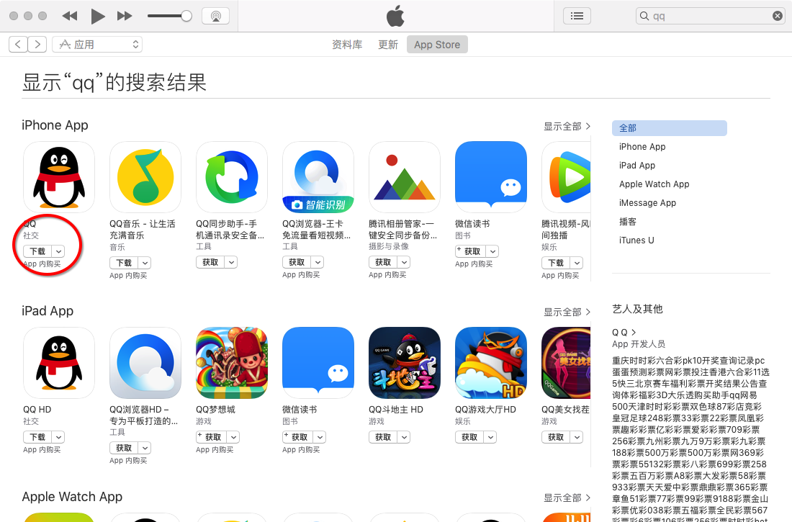 

点击下载，抓包如下
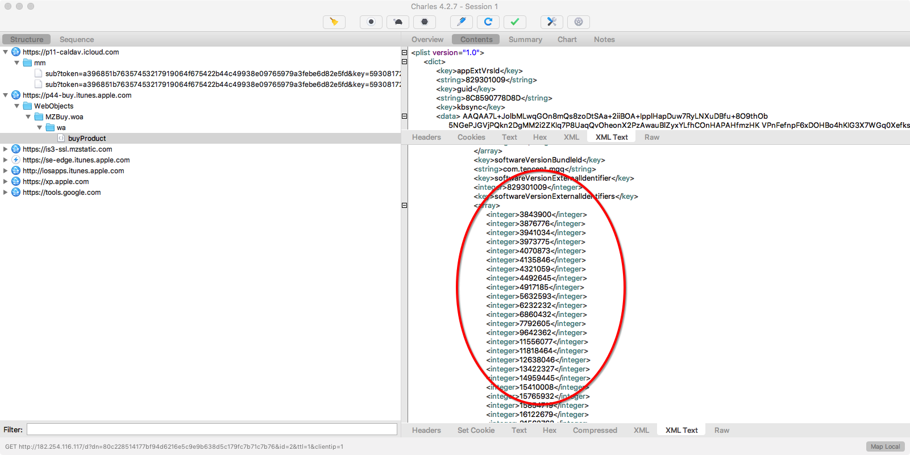 
红圈处都是QQ的历史版本编号，最底部是最新的版本编号，从下往上，对照AppStore上的发布版本从上往下，就可以下载到对应的历史App版本

删除当前下载任务
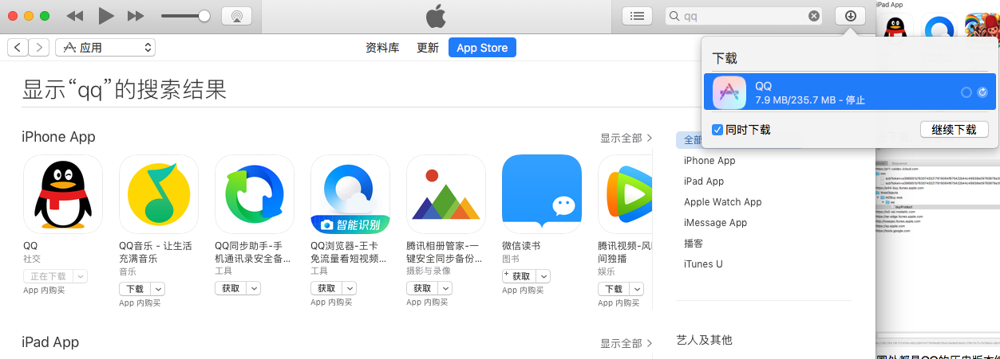 

在 https://p44-buy.itunes.apple.com/WebObjects/MZBuy.woa/wa/buyProduct 出下断点拦截请求

重新搜索下载QQ，修改红圈处为上面拿到的QQ历史编号，这边修改为3843900
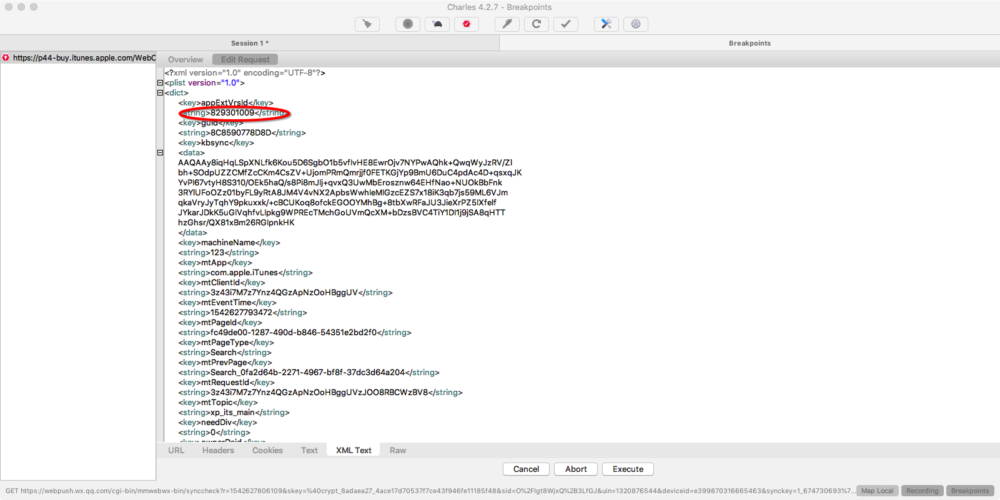 
点击 Execute, 会断点两次，继续执行，然后等待下载结果

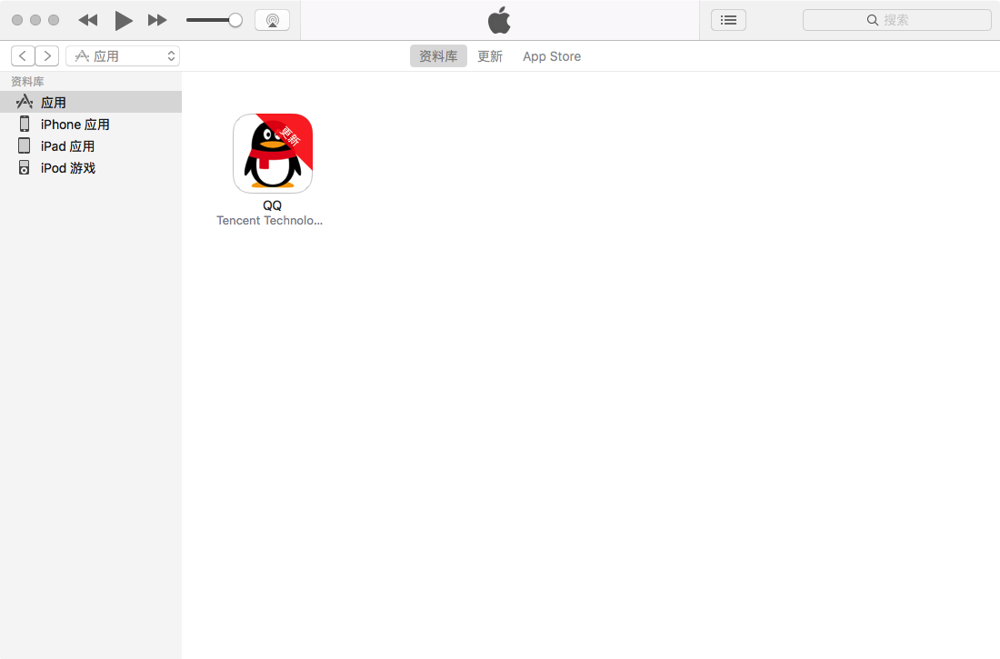 
显示如图说明下载到了历史版本，右键 在Finder中显示，将QQ ipa后缀改成zip解压文件，进入Payload，右键显示内容，查看Info.plist你会发现你下载的版本确实是历史1.0 版本，当前Store上的版本为 7.9.0