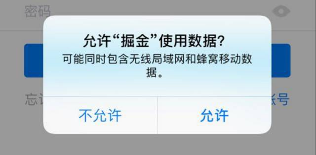

# iOS10 国行版本 网络权限问题
背景：工信部要求，用户没同意之前不能进行联网请求，所以只有国行版本有这个问题
影响：如果用户不同意网络，将拒绝所有的网络请求

## 如何判断是否国行
如果能找到以下内容,就代表是国行的机子
 
设置->无线局域网->使用WLAN与蜂窝移动网络的应用 

## 如何重置成新设备让首次安装App进行网络权限设置弹窗

设置->通用->还原->抹掉所有内容和设置

注意：该操作会重置设备所有网络连接状态，删掉所有已安装App，相当于出厂设置，请备份后再操作

## 现象

## 用户已经拒绝如何使用网络

## 代码解决方案
1. 在appDelegate中监听网络状态变化，当用户点击同意弹窗时，能够检测到网络变化重新请求相关数据
2. 首页及启动配置信息写成递归调用，不断重试直到请求到数据为止
3. 用户直接拒绝，显示一个提示页面，如上图让用户自己操作

## 检测联网权限
以下代码暂时没有实际检验

~~~
1，检测联网权限

首先要导入   
@import CoreTelephony;

- (void)checkNetwork{

    CTCellularData *cellularData = [[CTCellularData alloc]init];

    cellularData.cellularDataRestrictionDidUpdateNotifier =  ^(CTCellularDataRestrictedState state){

        BOOL _isRestricted = YES;

        //获取联网状态

        switch (state) {

            case kCTCellularDataRestricted:

                NSLog(@"Restricted"); //拒绝

                break;

            case kCTCellularDataNotRestricted:

                _isRestricted = NO;

                NSLog(@"Not Restricted"); //允许

                break;

            case kCTCellularDataRestrictedStateUnknown:

                NSLog(@"Unknown"); //未知

                break;

            default:

                break;

        };

        if (_isRestricted  == YES) {

            [self requestNetwork];

        }

    };

}

2,假设在程序没有联网权限的时候，去（使用网络）连接一下百度

- (void)requestNetwork{

    NSURL *url = [NSURL URLWithString:@"http://www.baidu.com"];

    NSURLRequest *request = [NSURLRequest requestWithURL:url];

    [NSURLConnection sendAsynchronousRequest:request queue:[NSOperationQueue mainQueue] completionHandler:^(NSURLResponse * _Nullable response, NSData * _Nullable data, NSError * _Nullable connectionError) {

    }];

}
~~~