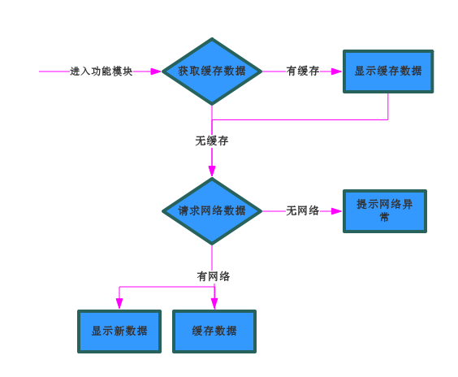
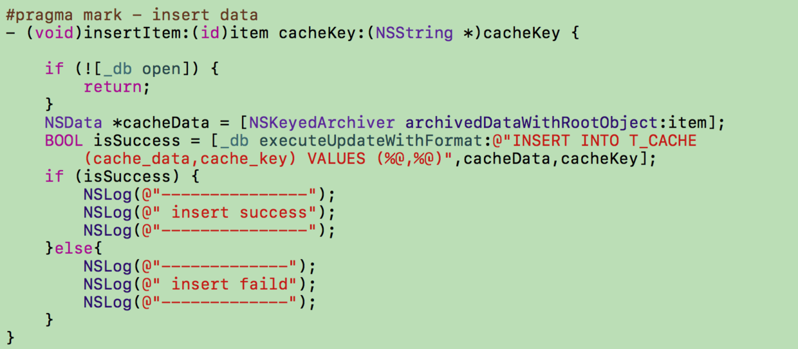

# App 数据缓存策略

## 原则
+ 无网络或者网络很差时能及时显示界面，提升用户体验
+ 请求到新数据时更新本地缓存数据

## 数据缓存方式
+ 缓存至Plist文件
+ 缓存至沙盒
+ 缓存至CoreData
+ 缓存至数据库

本篇讨论缓存至数据库策略
## 流程

## 数据库设计
### Realm
~~~
import RealmSwift

public class CacheModel {
	 @objc dynamic var cacheKey: String = ""
    @objc dynamic var cacheString: String = ""
    var json: JSON {
        set {
            if let string = newValue.rawString() {
                self.cacheString = string
            } else {
                self.cacheString = ""
            }
        }
        get {
            return  JSON(parseJSON: self.cacheString)
        }
    }
}

extension CacheModel {
    public static func saveCache(key: String, json: JSON) {
        guard let realm = try? Realm() else {
            return
        }
        
        if let model = realm.objects(CacheModel.self).filter(NSPredicate(format: "cacheKey = %@", key)).first {
            try? realm.write {
                model.json = json
            }
        } else {
            let model = CacheModel()
            model.json = json
            model.cacheKey = key
            try? realm.write {
                realm.add(model)
            }
        }
    }
    
    public static func loadCache(key: String) -> JSON {
        guard let realm = try? Realm() else {
            return JSON.null
        }
        
        if let model = realm.objects(CacheModel.self).filter(NSPredicate(format: "cacheKey = %@", key)).first {
            return model.json
        }
        
        return JSON.null
    }
    
    public static func deleteCache(key: String) {
        guard let realm = try? Realm() else {
            return
        }
        if let model = realm.objects(CacheModel.self).filter(NSPredicate(format: "cacheKey = %@", key)).first {
            realm.delete(model)
        }
    }
}
~~~

### SQLite

+ cache_data 是缓存的二进制数据
+ cache_key 是缓存时唯一的key，通过唯一的key就可以获取的对应的缓存数据

## 缓存key设计： URL+参数

+ 一个模块一个URL，则使用URL作为唯一key，比如一些只是简单get的请求列表
+ 不同模块同一个基本URL，通过参数区分获取数据，则使用URL+参数作为唯一key

为什么使用 URL+参数方式?

+ URL+参数可以区分接口唯一性，所以可以作为唯一key来缓存数据
+ 一般App为了便于测试都会部署测试环境，线上环境，并且App内部会置一个环境切换开关，这个时候如果缓存了测试环境的数据，切换到线上环境去使用就会发生数据紊乱的问题，如果使用URL+参数就可以避免这种坑
+ 通用性较强，可以避免耦合

拼接参数问题

+ 中文参数进行UrlEncode
+ 非字符串基本类型参数转换成字符串
+ 字符串参数直接拼接

项目中使用的是Swift并且使用了Alamofire网络库，这个库里面已经很好的处理了这些问题，所以封装了一个函数进行URL和参数的拼接

~~~
    // URL + 请求参数拼接成缓存唯一标识符
    static func cacheKey(url: String, parameters: [String: Any]?) -> String {
        
        if let requestUrl = URL(string: url) {
            let request = URLRequest(url: requestUrl)
            do {
                let encodeRequest = try URLEncoding.default.encode(request, with: parameters)
                if let newUrl = encodeRequest.url {
                    return newUrl.absoluteString
                }
                if let newUrl = request.url {
                    return newUrl.absoluteString
                }
            } catch {
                if let newUrl = request.url {
                    return newUrl.absoluteString
                }
                return url
            }
        }

        return url
    }
~~~

## 思考 
缓存爆炸造成垃圾数据 

+ 将缓存保存至沙盒Library中，在系统存储空间不足时，系统会自动清理该文件中的内容
+ 添加清理缓存的功能用户自行清理
+ 设定一个时间阀值和缓存大小阀值，这两个值其中一个满足条件则自动清理一部分垃圾数据或者全部清理

## 好处
+ 方便添加离线下载功能，比如新闻类App，离线后无网络依然能够阅读
+ 方便添加清理缓存功能