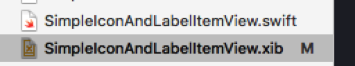
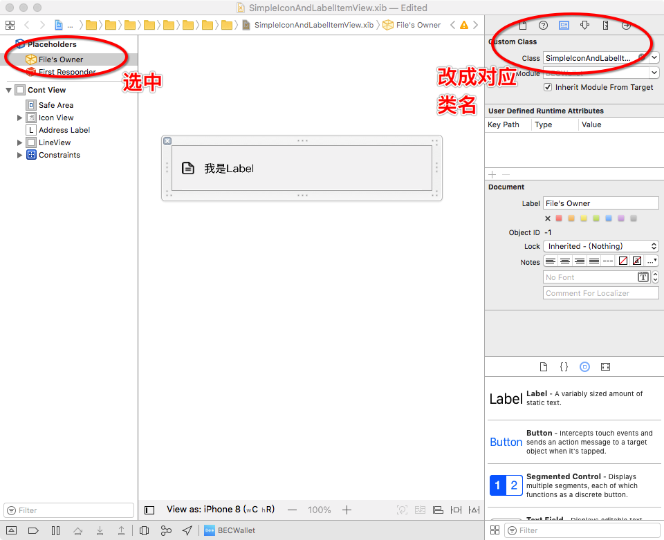
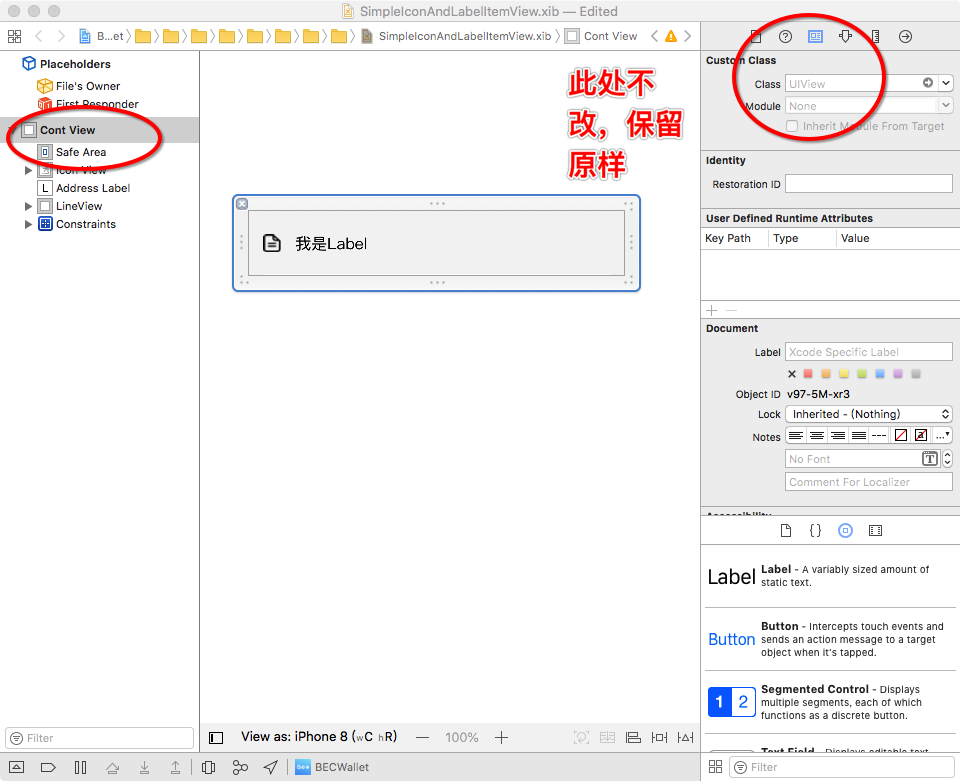

## Swift IB开发之xib封装复用

### xib封装
使用xib封装一个view，能够在其它xib、sb中使用
目的：使用xib便利布局屏幕适配UI的优势

### 1.新建一个带xib的类

### 2.绑定xib的File Owner

选中File's Owner 右边红框对应位置改成对应的封装类名

### 3.SimpleIconAndLabelItemView.swift 代码实现如下

~~~
import Foundation

@IBDesignable class SimpleIconAndLabelItemView: UIView {
    @IBOutlet var contView: UIView!
    @IBOutlet weak var iconView: UIImageView!
    @IBOutlet weak var addressLabel: UILabel!
    @IBOutlet weak var lineView: UIView!
    
    override init(frame: CGRect) {
        super.init(frame: frame)
        initFromXib()
    }
    
    required init?(coder aDecoder: NSCoder) {
        super.init(coder: aDecoder)
        initFromXib()
    }
    
    func initFromXib() {
        let bundle = Bundle.init(for: SimpleIconAndLabelItemView.self)
        let nib = UINib(nibName: "SimpleIconAndLabelItemView", bundle: bundle)
        contView = nib.instantiate(withOwner: self, options: nil)[0] as! UIView
        contView.frame = bounds
        self.addSubview(contView)
        lineView.backgroundColor = UIColor.iLineGary
    }
}
~~~

3. contView 需拉线连接到 Cont View 上
4. @IBDesignable关键字表示在其它xib上应用当前类时能在xib上实时看到封装效果

之后就能愉快的在IB中使用当前封装的xib了，拖动一个View到IB指定位置，然后把
Custom Class 改成封装的SimpleIconAndLabelItemView即可，这样就成功的复用了封装的xib。

