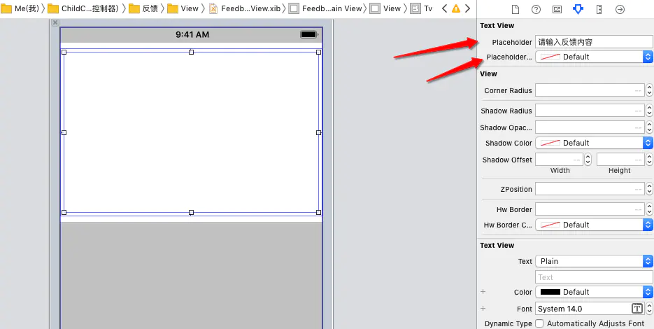

# UITextView

+ 添加占位符，支持xib

  + xib 设置

    

  + 代码设置

  ```swift
  import Foundation
  import UIKit
  
  extension UITextView {
      
      private struct RuntimeKey {
          static let hw_placeholderLabelKey = UnsafeRawPointer.init(bitPattern: "hw_placeholderLabelKey".hashValue)
          /// ...其他Key声明
      }
      /// 占位文字
      @IBInspectable public var placeholder: String {
          get {
              return self.placeholderLabel.text ?? ""
          }
          set {
              self.placeholderLabel.text = newValue
          }
      }
      
      /// 占位文字颜色
      @IBInspectable public var placeholderColor: UIColor {
          get {
              return self.placeholderLabel.textColor
          }
          set {
              self.placeholderLabel.textColor = newValue
          }
      }
      
      private var placeholderLabel: UILabel {
          get {
              var label = objc_getAssociatedObject(self, UITextView.RuntimeKey.hw_placeholderLabelKey!) as? UILabel
              if label == nil { // 不存在是 创建 绑定
                  if (self.font == nil) { // 防止没大小时显示异常 系统默认设置14
                      self.font = UIFont.systemFont(ofSize: 14)
                  }
                  label = UILabel.init(frame: self.bounds)
                  label?.numberOfLines = 0
                  label?.font = self.font
                  label?.textColor = UIColor.lightGray
                  self.addSubview(label!)
                  self.setValue(label!, forKey: "_placeholderLabel")
                  objc_setAssociatedObject(self, UITextView.RuntimeKey.hw_placeholderLabelKey!, label!, .OBJC_ASSOCIATION_RETAIN_NONATOMIC)
                  self.sendSubviewToBack(label!)
              }
              return label!
          }
          set {
              objc_setAssociatedObject(self, UITextView.RuntimeKey.hw_placeholderLabelKey!, newValue, .OBJC_ASSOCIATION_RETAIN_NONATOMIC)
          }
      }
  }
  ```

+ [UITextView 输入内容实时更新cell的高度](https://www.jianshu.com/p/adefc3eabdd4) 

