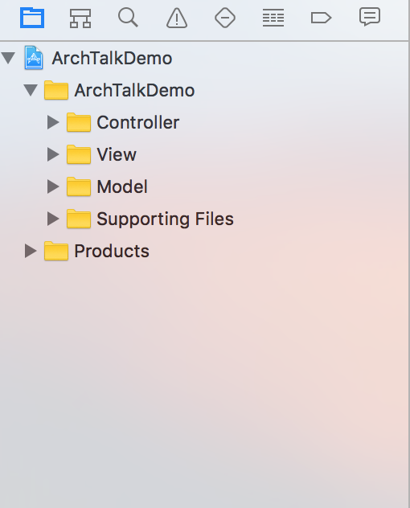
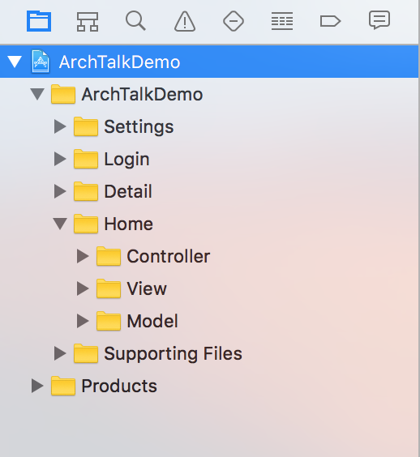
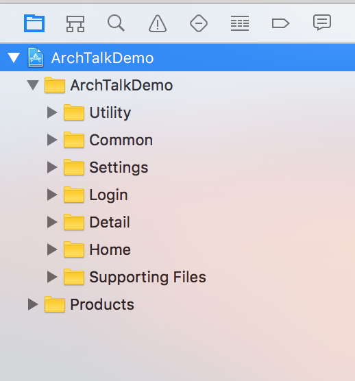
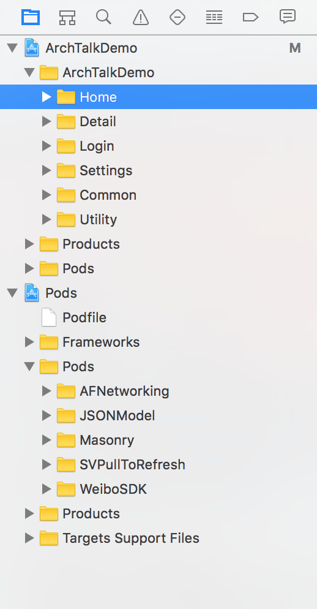
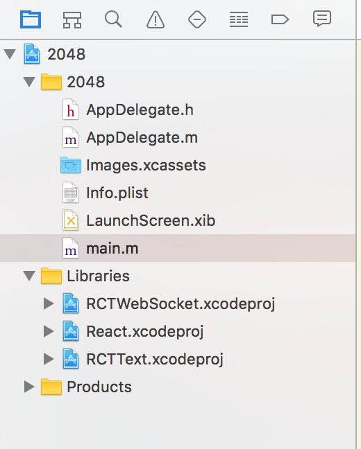
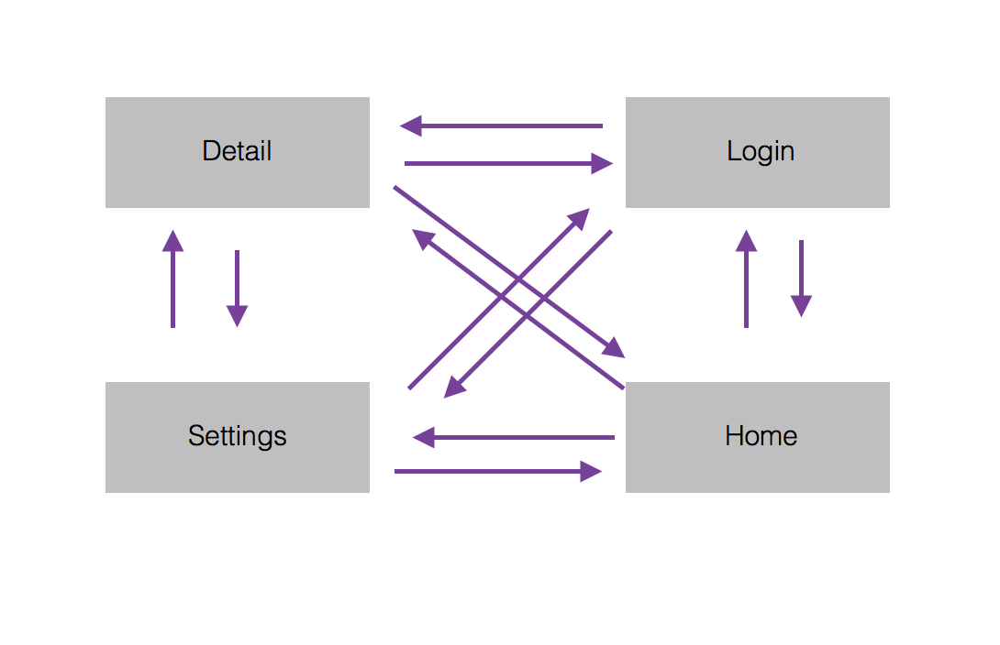
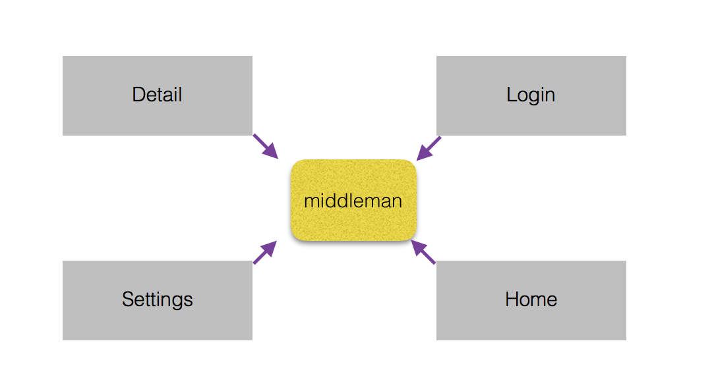

#iOS工程项目结构
### 一、普通原始架构

### 二、分模块的架构

工具类、公用类

集成Cocapods之后

### 三、子工程架构

### 四、模块解耦

#### middleman（中间人模式）

如图所示，我们只需将所有的模块依赖这个middleman，让middleman来处理各个模块的关系，模块A如果需要依赖模块B，完全可以考middleman来处理，并且返回模块A所需要的模块B的内容，这样就解决了解耦。

#### urlRoute

