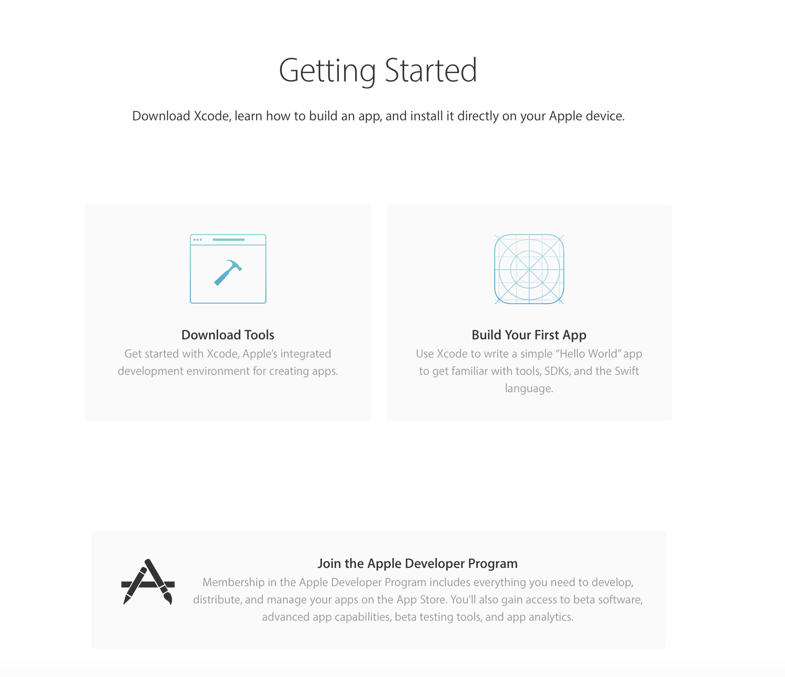

# 苹果开发者账号申请
## 一、申请条件
+ 公司必须是法人实体如大型企业、有限合伙、有限责任公司；
有营业许可（比如国内的营业执照）
+ 有自己的官网（国内公司的官网必须有备案）,有企业邮箱
+ 企业规模必须100人以上

## 二、申请步骤，总共4步骤
+ 申请AppleID 
+ 申请邓白氏编码
+ 提交Enrollment申请
+ 给苹果公司付年费299美金
+ 申请时长：国内预计10-15天完成

## 三、申请材料
+ 营业执照(不可用扫描件、复印件，需原件照片)
+ 公司公章正面照(需要实物照片)
+ 确认知悉函(苹果发的邮件中有个附件，下载下来打印，然后盖上公司公章，签名，拍照上传)
+ 商事主体公示（扫描营业执照二维码出现的）

+ 公司名称 中英文
+ 法人姓名 身份证上的中文跟拼音
+ 公司地址（城市 省份 邮编）
+ 邓白氏码
+ 官网
+ 工作电话 接打苹果信息核实电话
+ 税务编号
+ 接收审核信息邮箱
+ 支付
 + VISA信用卡
 + 邮箱地址
 + 发票title
 + 发票邮寄地址 

### 电话审核注意事项：
+ 苹果来电一般是0019163997992 或者  0015126742000；
+ 苹果一般打官网上的固话；
+ 苹果一般先找申请人，再找法人验证

### 苹果主要问申请人以下问题：
+ 是不是有申请苹果账号？答：是
+ 问帐号的使用对象？答：公司的员工；
+ 问申请的账号用途是？答：用在XXX系统上
+ 问公司规模（即公司有多少人)?答：目前有>100人
+ 问公司什么时候成立？答XXX
+ 如果苹果还有咨询其他问题或者问你是不是有想要了解的，就说暂时没有
+ 苹果确认完信息后，2-3工作日内会进入下个审核找验证人 
+ 苹果公司找到验证人后，会问以下问题：
+ 公司是不是有叫XXX的员工？答：有
+ 是否有授权XXX申请苹果账号？答：有授权
+ 是否还有其他问题咨询？答：没有
+ 回答完以上三个问题后，苹果会说会在5-10分钟内收到苹果公司的一封Agreement电子邮件，电话基本就结束了。到时请及时与我们联系确认是否收到邮件，谢谢！

## 苹果开发者账号具体操作流程：
### 申请AppleID
[注册链接](https://appleid.apple.com/account/home#!&page=create)

+ 有时候会出现注册不成功的情况，请尝试切换网络，这方面可能苹果IP有限制，当一个网络IP申请 过多AppleID的时候会一直不成功；
+ 若是切换网络还无法注册成功，可用iPhone手机进行注册，建议使用4G网络
+ 建议使用163邮箱或者公司邮箱，QQ邮箱可能有时候会注册失败
+ 发送验证码环节可能会出现收不到验证码，或者即便在两分钟内输入验证码，该系统也会提示验证码错误或验证码过期，多试几次

邮箱不要使用QQ邮箱
### 申请邓白氏码
+ [打开苹果开发者中心](https://developer.apple.com)
选择Account模块登录申请好的AppleID 
+ 选择 Join the Apple Developer Program

+ 选择 Enroll 

点击链接进入后先登录，若是无法进入到填写申请信息页面，可自行访问开发者中心登录账号，点击account->Join the Apple Developer Program->Start Your Enrollment；系统会验证你的身份信息，检查信息的完整性。
