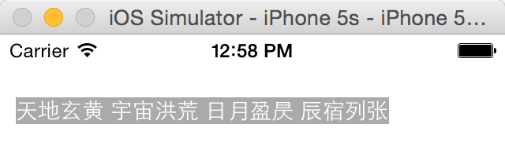
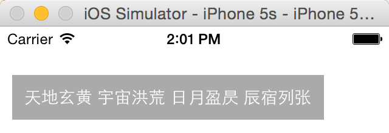
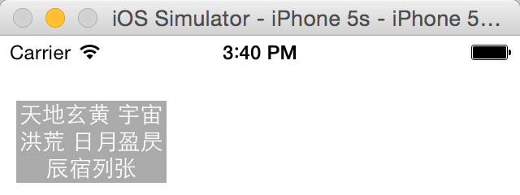
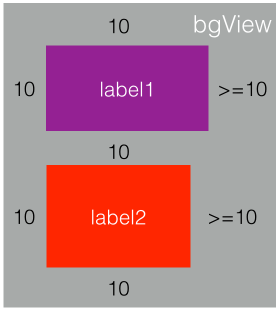
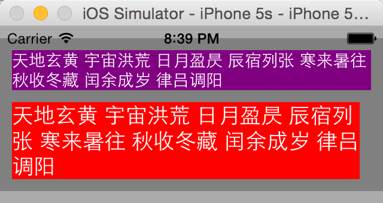
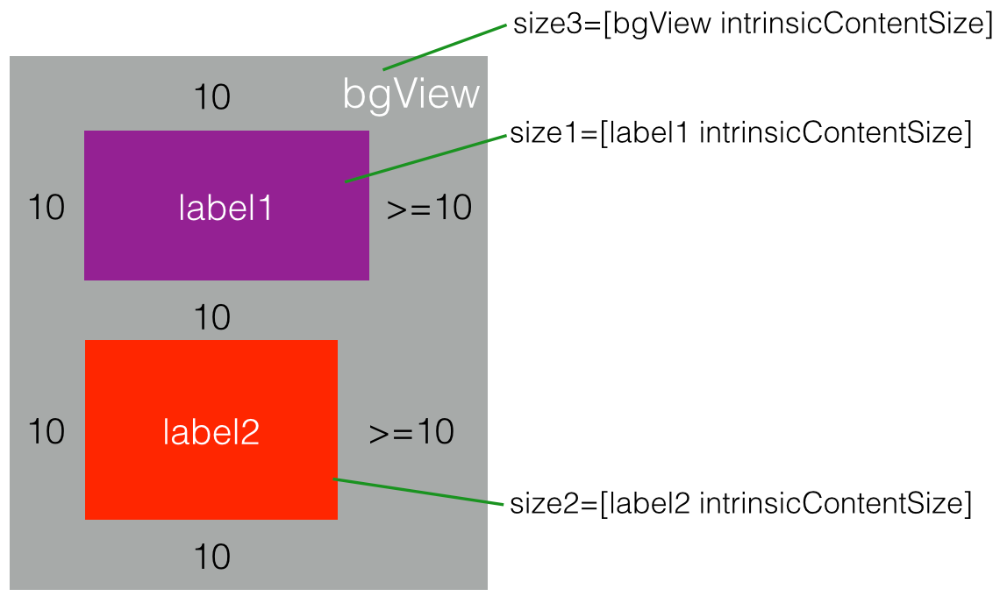
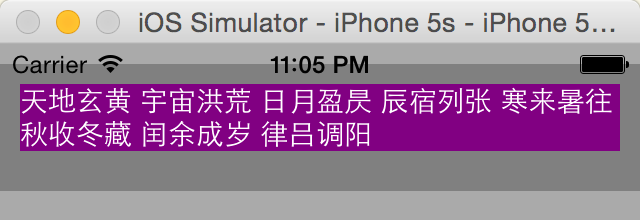
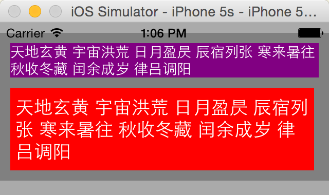

#  深入理解 Auto Layout 

iOS 的的布局机制「auto layout」不是一个新概念，它早在 iOS 6 中就推出来了，当下距离 iOS 9 正式版面世已不远矣，我却对它的了解还比较初级。

我之前对 auto layout 机制的理解非常粗浅，几乎把它和「constraint」对等。对它的使用有这么几个阶段：

1. Storyboard 中通过拖拽设置 constraints；
2. 学习 VFL（Visual Format Language）语法使用代码设置 constraints；
3. 使用大杀器[Masonry](https://github.com/SnapKit/Masonry)。

> P.S: iOS 的 VFL 语法实在太罗嗦了，又臭又长且可读性差难于调试，无法忍受，Masonry 正是解决这一痛点的第三方库，非常好用，学习成本非常低。

近期因为项目，我需要实现一个能够自适应文本自动调整高度的 table view cell。网上有相关丰富的资源（category、博客等），思路都非常简单，比如这篇：[动态计算 UITableViewCell 高度详解](http://www.cocoachina.com/industry/20140604/8668.html)。但即便如此，我对有些东西理解起来还有障碍，譬如`systemLayoutSizeFittingSize:`和`sizeThatFits:`之类的，想到我都将近有大半年的开发经验了，居然还无法理解这么简单的东西，不能忍！

导致这种结果的主要原因有俩：一是之前项目比较简单，涉及 auto layout 相关的知识无非是 add/update/remove constraints；二是自己太轻浮，把 auto layout 想得太简单。

通过对各种资讯梳理，大概搞明白了自己最大的问题是对 auto layout 相关的各种 API 不熟悉或者完全陌生，这导致了无法在一些实际问题中使用正确的策略解决问题。本文的着重点正是结合各种资料加上自己的理解对这些 API 进行分析。

本文涉及的 API 包括：

- `sizeThatFits:`和`sizeToFit`
- `systemLayoutSizeFittingSize:`
- `intrinsicContentSize`

> P.S: 这几个 API 都是与 size 相关，该如何使用它们呢？这曾让笔者一时非常困惑。以上这几个 API 都是 UIView 的实例方法，除此之外，本文还涉及一些属性，譬如`preferredMaxLayoutWidth`。

### iOS 布局机制

iOS 布局机制大概分这么几个层次：

- frame layout
- autoresizing
- auto layout

**frame layout**

frame layout 最简单直接，简单来说，即通过设置 view 的`frame`属性值进而控制 view 的位置（相对于 superview 的位置）和大小。

**autoresizing**

autoresizing 和 frame layout 一样，从一开始存在，它算是后者的补充，基于 autoresizing 机制，能够让 subview 和 superview 维持一定的布局关系，譬如让 subview 的大小适应 superview 的大小，随着后者的改变而改变。

站在代码接口的角度来看，autoresizing 主要体现在几个属性上，包括（但不限于）：

1. `translatesAutoresizingMaskIntoConstraints`
2. `autoresizingMask`

第一个属性标识 view 是否愿意被 autoresize； 第二个属性是一个枚举值，决定了当 superview 的 size 改变时，subview 应该做出什么样的调整；

关于 autoresizing 的更详细使用说明，参考：[自动布局之 autoresizingMask 使用详解](http://www.cocoachina.com/ios/20141216/10652.html)。

**auto layout**

autoresizing 存在的不足是非常显著的，通过`autoresizingMask`的可选枚举值可以看出：基于 autoresizing 机制，我们只能让 view 在 superview 的大小改变时做些调整；而无法处理兄弟 view 之间的关系，譬如处理与兄弟 view 的间隔；更无法反向处理，譬如让 superview 依据 subview 的大小进行调整。

Auto Layout 是随着 iOS 6 推出来的，关于它的介绍，官方文档《Auto Layout Guide》的描述非常精炼：

> Auto Layout is a system that lets you lay out your app’s user interface by creating a mathematical description of the relationships between the elements. You define these relationships in terms of constraints either on individual elements, or between sets of elements. Using Auto Layout, you can create a dynamic and versatile interface that responds appropriately to changes in screen size, device orientation, and localization.

简单来说，它是一种基于约束的布局系统，可以根据你在元素（对象）上设置的约束自动调整元素（对象）的位置和大小。

值得一提的是，对于某个 view 的布局方式，autoresizing 和 auto layout 只能二选一，简单来说，若要对某个 view 采用 auto layout 布局，则需要设置其`translatesAutoresizingMaskIntoConstraints`属性值为`NO`。

### 几个重要的 API

**intrinsicContentSize 方法**

在介绍`intrinsicContentSize`方法之前，先来看一个应用场景：

场景一：某个 UILabel 用于显示**单行**文本，让其能够自适应文本，即根据文本自动调整其大小。

让 UILabel 自适应文本，在 auto layout 之前，一般做法是先给定字体，进而计算文本内容所占据的宽度 width 和高度 height，然后使用得来的 width 和 height 设置其`frame`属性值。

但是使用 auto layout 非常简单，如下：

```objectivec
@interface ViewController () {
    UILabel *testLabel;
}
    
- (void)viewDidLoad {
    [super viewDidLoad];
    
    self.view.backgroundColor = [UIColor whiteColor];
    
    testLabel = ({
        UILabel *label        = [[UILabel alloc] init];
        label.textAlignment   = NSTextAlignmentCenter;
        label.font            = [UIFont systemFontOfSize:14.0];
        label.textColor       = [UIColor whiteColor];
        label.backgroundColor = [UIColor lightGrayColor];
        label;
    });
    [self.view addSubview:testLabel];
    
    // 使用Masonry添加constraints
    [testLabel mas_makeConstraints:^(MASConstraintMaker *make) {
        make.top.equalTo(self.view.mas_top).offset(40);
        make.left.equalTo(self.view.mas_left).offset(10);
    }];
    testLabel.text = @"天地玄黄 宇宙洪荒 日月盈昃 辰宿列张";
}
    
- (void)viewDidAppear:(BOOL)animated {
    [super viewDidAppear:animated];
    NSLog(@"testLabel.origin = %@", NSStringFromCGPoint(testLabel.frame.origin));
    NSLog(@"testLabel.size = %@", NSStringFromCGSize(testLabel.frame.size));
    // print: "testLabel.origin = {10, 40}"
    // print: "testLabel.size = {236.5, 17}"
}
```

效果如下：



问题来了，auto layout system 知道 testLabel 的 size 呢？

OK，就此引入 API `intrinsicContentSize`。

`intrinsicContentSize`是 UIView 的基础方法（Available in iOS 6.0 and later），[UIView Class References](https://developer.apple.com/library/ios/documentation/UIKit/Reference/UIView_Class/)对它的描述如下：

> Returns the natural size for the receiving view, considering only properties of the view itself.  **Return Value** A size indicating the natural size for the receiving view based on its intrinsic properties.  **Discussion** Custom views typically have content that they display of which the layout system is unaware. Overriding this method allows a custom view to communicate to the layout system what size it would like to be based on its content. This intrinsic size must be independent of the content frame, because there’s no way to dynamically communicate a changed width to the layout system based on a changed height, for example. If a custom view has no intrinsic size for a given dimension, it can return UIViewNoIntrinsicMetric for that dimension.

「intrinsic content size」在中文世界里常被译作：「固有内容大小」，简单来说，**它被用来告诉 auto layout system 应该给它分配多大的 size**。

所以呢，在上文代码（**场景一**的 Solution）中，根据我的理解，layout 工作流程是这样的：在 layout 时，auto layout system 会去回调 testLabel 的实例方法`intrinsicContentSize`，该方法能够根据「文本内容+字体」计算出 content 的 size，进而根据此 size 对 testLabel 进行布局。

为了验证这个说法，对上述代码做些改变。

首先定义一个继承自 UILabel 的类 ZWLabel，重写 ZWLabel 的`intrinsicContentSize`方法，如下：

```objectivec
@interface ZWLabel : UILabel
    
@end
    
@implementation ZWLabel
    
- (CGSize)intrinsicContentSize {
    CGSize size = [super intrinsicContentSize];
    size.width  += 20;
    size.height += 20;
    return size;
}
    
@end
```

然后让上文的`testLabel`从`UILabel`的实例改为`ZWLabel`的实例，其余不变：

```objectivec
testLabel = ({
    ZWLabel *label = [[ZWLabel alloc] init];
    //...
    label;
});
```

效果如下：



效果明显，本示例较为直观说明了`intrinsicContentSize`这个 API 的作用了，这个 API 是为 auto layout system 的 callback 提供的！

P.S：笔者刚开始对`intrinsicContentSize`这个 API 的用法感到非常疑惑，在我的理解里，它有两种可能：

1. Auto Layout System 会根据 content 为 view 设置一个合适的 size，开发者有时需要知道这个 size，因此可以通过`intrinsicContentSize`获取；
2. Auto Layout System 在 layout 时，不知道该为 view 分配多大的 size，因此回调 view 的`intrinsicContentSize`方法，该方法会给 auto layout system 一个合适的 size，system 根据此 size 对 view 的大小进行设置；

现在看来，第二种理解更靠谱！

对于上文所用到的`UILabel`，想必 Cocoa 在实现`intrinsicContentSize`方法时已经根据`text`属性值和`font`属性值进行了计算。那是不是每个原生 view 都实现了`intrinsicContentSize`呢？

NO！《[Auto Layout Guide](https://developer.apple.com/library/watchos/documentation/UserExperience/Conceptual/AutolayoutPG/AutoLayoutConcepts/AutoLayoutConcepts.html)》在谈论「intrinsic content size」时，总会与另外一个词语「leaf-level views」相关联，譬如：

> **Intrinsic Content Size** Leaf-level views such as buttons typically know more about what size they should be than does the code that is positioning them. This is communicated through the **intrinsic content size**, which tells the layout system that a view contains some content that it doesn’t natively understand, and indicates how large that content is, intrinsically.

「leaf-level views」指的是那种一般不包含任何 subview 的 view，譬如`UILabel`、`UIButton`等，这类的 view 往往能够直接计算出 content（譬如`UILabel`的 text、`UIButton`的 title，`UIImageView`的 image）的大小。

但是有些 view 不包含 content，譬如`UIView`，这种 view 被认为「has no intrinsic size」，它们的`intrinsicContentSize`返回的值是`(-1,-1)`。

> P.S: 官方文档中说的是：UIView's default implementation is to return (UIViewNoIntrinsicMetric, UIViewNoIntrinsicMetric)，而 UIViewNoIntrinsicMetric 等于`-1`，为什么是`-1`而不是`0`，我猜是`0`是一个有效的 width/height，而`-1`不是，更容易区分处理。

还有一种 view 虽然包含 content，但是`intrinsicContentSize`返回值也是`(-1,-1)`，这类 view 往往是`UIScrollView`的子类，譬如`UITextView`，它们是可滚动的，因此 auto layout system 在对这类 view 进行布局时总会存在一些未定因素，Cocoa 干脆让这些 view 的`intrinsicContentSize`返回`(-1,-1)`。

**preferredMaxLayoutWidth 属性**

基于上述**场景一**，我们来分析更复杂一点的 UILabel 自适应问题。

场景二：某个 UILabel 用于显示**多行**文本，让其能够自适应文本，即根据文本自动调整其大小；

对于单行文本 UILabel，UILabel 的`intrinsicContentSize`在计算 content size 时比较容易；但对于多行文本的 UILabel，同样的 content，譬如「天地玄黄宇宙洪荒」这八个字，摆放方式可以是 1x8，可以是 2x4，可以是 4x2，auto layout system 该如何处理呢？UILabel 的属性`preferredMaxLayoutWidth`正是用来应对这个问题的。

[UILabel Class References](https://developer.apple.com/library/ios/documentation/UIKit/Reference/UILabel_Class/)对它的描述如下：

> The preferred maximum width (in points) for a multiline label.  **Discussion** This property affects the size of the label when layout constraints are applied to it. During layout, if the text extends beyond the width specified by this property, the additional text is flowed to one or more new lines, thereby increasing the height of the label.

`preferredMaxLayoutWidth`的作用顾名思义，用来限制 UILabel content size 的最大宽度值。如下代码：

```objectivec
testLabel = ({
    UILabel *label                = [[UILabel alloc] init];
    label.textAlignment           = NSTextAlignmentCenter;
    label.font                    = [UIFont systemFontOfSize:14.0];
    label.textColor               = [UIColor whiteColor];
    label.numberOfLines           = 0;      // mark
    label.preferredMaxLayoutWidth = 100;    // mark
    label.backgroundColor         = [UIColor lightGrayColor];
    label;
});
[self.view addSubview:testLabel];
    
// 使用Masonry添加constraints
[testLabel mas_makeConstraints:^(MASConstraintMaker *make) {
    make.top.equalTo(self.view.mas_top).offset(40);
    make.left.equalTo(self.view.mas_left).offset(10);
}];
    
testLabel.text = @"天地玄黄 宇宙洪荒 日月盈昃 辰宿列张";
```

效果如下：



那么最后`testLabel`的 width 是不是就是`preferredMaxLayoutWidth`的属性值呢？No，最终`testLabel`的属性值小于等于`preferredMaxLayoutWidth`的属性值。

**sizeThatFits:方法和 sizeToFit 方法**

上文已经提到，`UITextView`继承自`UIScrollView`，是可以滚动的，它的`intrinsicContentSize`方法返回值是`(-1,-1)`，auto layout system 在处理 UITextView 对象时，为其设置的 size 是`(0,0)`。如此看来，似乎`UITextView`无法体验到 auto layout 带来的好处了。

继续结合应用场景引出`sizeThatFits:`方法和`sizeToFit`方法。

场景三：某个`UITextView`用于显示文本，让其能够自适应文本，即根据文本自动调整其大小；

既然 UITextView 的 content 计算方法`intrinsicContentSize`无法向 auto layout system 传递我们想要传达的值，我们就应该另想别的方法。

好在 iOS 有直接的接口可供我们使用。

先谈`sizeThatFits:`方法，[UIView Class References](https://developer.apple.com/library/ios/documentation/UIKit/Reference/UIView_Class/)对它的描述如下：

> Asks the view to calculate and return the size that best fits the specified size.  **Return Value** A new size that fits the receiver’s subviews.  **Discussion** The default implementation of this method returns the existing size of the view. Subclasses can override this method to return a custom value based on the desired layout of any subviews. For example, a UISwitch object returns a fixed size value that represents the standard size of a switch view, and a UIImageView object returns the size of the image it is currently displaying.

简单来说，调用`sizeThatFits:`方法意味着「根据文本计算最适合 UITextView 的 size」。从功能来讲，`sizeThatFits:`和`intrinsicContentSize`方法比较类似，都是用来计算 view 的 size 的。笔者曾一度对二者的关系非常疑惑，甚至觉得二者存在相互调用的关系。后来通过验证发现不是这么回事儿，后文会通过示例说明。

对于显示多行文本的`UILabel`，为了方便`intrinsicContentSize`方法更方便计算 content size，需要指定`preferredMaxLayoutWidth`属性值；对于`UITextView`的`sizeThatFits:`，似乎有类似的需求，毕竟`UITextView`也可能会显示多行啊，这样说来，`UITextView`也有一个`preferredMaxLayoutWidth`属性？

No！`preferredMaxLayoutWidth`属性是 iOS 6 才引入的，`sizeThatFits:`方法则早得多，况且，`UITextView`是可以滚动的，哪怕文本不会全部呈现出来，但也可以通过左右或者上下滚动浏览所有内容；传给`sizeThatFits:`的参数（假设为 size）是`CGSize`类型，size.width 的功能和`UILabel`的`preferredMaxLayoutWidth`差不多，指定了`UITextView`区域的最大宽度，size.height 则指定了`UITextView`区域的最大高度；可能有人问，若传给`sizeThatFits:`的 size 小于`UITextView`的 text 面积怎么办，岂不是有些内容无法显示出来？傻啊，可以滚啊！

值得一提的是，调用`sizeThatFits:`并不改变 view 的 size，它只是让 view 根据已有 content 和给定 size 计算出最合适的 view.size。

那么`sizeToFit`方法是干嘛的呢？很简单：

> calls sizeThatFits: with current view bounds and changes bounds size.

P.S：有点不太理解，这个「current view」指的是啥？self？还是 superview？ P.P.S：经过验证，这里的「current view」指的是`self`。简单来说，`sizeToFit`等价于：

```objectivec
// calls sizeThatFits
CGSize size = [self sizeThatFits:self.bounds.size];
// change bounds size
CGRect bounds = self.bounds;
bounds.size.width = size.width;
bounds.size.height = size.width;
self.bounds = bounds;
```

P.S：值得一提的是，经过测试发现，当调用`sizeThatFits:`的`size=(width, height)`，当 width/height 的值为 0 时，width/height 似乎就被认为是无穷大！

**systemLayoutSizeFittingSize:方法**

首先来看一个应用场景。

场景四：某个`UIView`，宽度等于屏幕宽度，包含两个`UILabel`，两个 label 都可能显示多行文本，要求结合 auto layout 让`UIView`大小能够自适应 subviews。

Easy，给出如下代码：

```objectivec
- (void)viewDidLoad {
    [super viewDidLoad];
    self.view.backgroundColor = [UIColor lightGrayColor];
    
    bgView = ({
        UIView *view         = [[UIView alloc] init];
        view.backgroundColor = [UIColor grayColor];
        view;
    });
    [self.view addSubview:bgView];
    
    label1 = ({
        UILabel *label                = [[UILabel alloc] init];
        label.font                    = [UIFont systemFontOfSize:14.0];
        label.preferredMaxLayoutWidth = self.view.frame.size.width-20;
        label.numberOfLines           = 0;
        label.textColor               = [UIColor whiteColor];
        label.backgroundColor         = [UIColor purpleColor];
        label;
    });
    [bgView addSubview:label1];
    
    label2 = ({
        UILabel *label                = [[UILabel alloc] init];
        label.font                    = [UIFont systemFontOfSize:18.0];
        label.preferredMaxLayoutWidth = self.view.frame.size.width-20;
        label.numberOfLines           = 0;
        label.textColor               = [UIColor whiteColor];
        label.backgroundColor         = [UIColor redColor];
        label;
    });
    [bgView addSubview:label2];
    
    // 添加约束（基于Masonry）
    [bgView mas_makeConstraints:^(MASConstraintMaker *make) {
        make.left.equalTo(self.view.mas_left);
        make.top.equalTo(self.view.mas_top).offset(10);
        make.width.equalTo(self.view.mas_width);
    }];
    
    [label1 mas_makeConstraints:^(MASConstraintMaker *make) {
        make.left.equalTo(bgView.mas_left).offset(10);
        make.right.lessThanOrEqualTo(bgView.mas_right).offset(-10);
        make.top.equalTo(bgView.mas_top).offset(10);
    }];
    
    [label2 mas_makeConstraints:^(MASConstraintMaker *make) {
        make.left.equalTo(label1.mas_left);
        make.right.lessThanOrEqualTo(bgView.mas_right).offset(-10);
        make.top.equalTo(label1.mas_bottom).offset(10);
        make.bottom.equalTo(bgView.mas_bottom).offset(-10);
    }];
    
    label1.text = @"天地玄黄 宇宙洪荒 日月盈昃 辰宿列张 寒来暑往 秋收冬藏 闰余成岁 律吕调阳";
    label2.text = @"天地玄黄 宇宙洪荒 日月盈昃 辰宿列张 寒来暑往 秋收冬藏 闰余成岁 律吕调阳";
}
```

代码看得有些枯燥，简单来说，bgView（UIView）中嵌入两个能显示多行文本的 label1（UILabel）和 label2（UILabel），设置约束如下：



代码运行后的显示效果：



代码中除了添加各种各样的 constraints，没有任何设置 frame 的代码，显然都是基于 auto layout 的。

那么问题来了，理解 label1 和 label2 的布局没啥子问题，因为它们的`intrinsicContentSize`方法会将 content size 告诉 auto layout system，进而后者会为它们的 size 设置对应值；但对于 bgView，它可是一个`UIView`对象，它的`intrinsicContentSize`回调方法的返回值为`(-1,-1)`，那么 auto layout system 是如何为它设置合适的 size 的呢？

根据我的理解，auto layout system 在处理某个 view 的 size 时，参考值包括：

- 自身的`intrinsicContentSize`方法返回值；
- subviews 的`intrinsicContentSize`方法返回值；
- 自身和 subviews 的 constraints；



OK，根据笔者理解，结合上图，我认为 auto layout system 是这样计算一下 bgView 的 size 的：

width=max{10+size1.width+10, 10+size2.width+10, size3.width} height=max{10+size1.height+10+size2.height+10, size3.height}

我们在`viewDidAppear:`方法中将相关值打印出来瞧瞧看：

```objectivec
- (void)viewDidAppear:(BOOL)animated {
    [super viewDidAppear:animated];
    
    CGSize size1 = [label1 intrinsicContentSize];
    CGSize size2 = [label2 intrinsicContentSize];
    CGSize size3 = [bgView intrinsicContentSize];
    
    NSLog(@"size1 = %@", NSStringFromCGSize(size1));    // print: "size1 = {300, 33.5}"
    NSLog(@"size2 = %@", NSStringFromCGSize(size2));    // print: "size2 = {290.5, 64.5}"
    NSLog(@"size3 = %@", NSStringFromCGSize(size3));    // print: "size3 = {-1, -1}"
    
    CGSize bgViewSize = bgView.frame.size;
    NSLog(@"bgViewSize = %@", NSStringFromCGSize(bgViewSize));  // print: "bgViewSize = {320, 128}"
}
```

完全吻合我理解的 auto layout size 计算公式。

P.S：然而，我知道，事实往往并没有这么简单，当处理自定义 View 时，当 constraints 设置不完整或者冲突时，事情总会变得复杂起来，也总会得到意想不到的结果。但，暂且就这么理解吧！

啰里啰嗦写了这么多，还没引出`systemLayoutSizeFittingSize:`方法...

OK，再来看另外一个应用场景。

场景五：某个`UIView`，宽度等于屏幕宽度，包含一个`UILabel`和一个`UITextView`，二者都可能显示多行文本，要求结合 auto layout 让`UIView`大小能够自适应 subviews。

在场景四代码基础上将 label2 改为 UITextView 对象 textView1，如下：

```objectivec
- (void)viewDidLoad {
    [super viewDidLoad];
    self.view.backgroundColor = [UIColor lightGrayColor];
    
    bgView = ({
        UIView *view         = [[UIView alloc] init];
        view.backgroundColor = [UIColor grayColor];
        view;
    });
    [self.view addSubview:bgView];
    
    label1 = ({
        UILabel *label                = [[UILabel alloc] init];
        label.font                    = [UIFont systemFontOfSize:14.0];
        label.preferredMaxLayoutWidth = self.view.frame.size.width-20;
        label.numberOfLines           = 0;
        label.textColor               = [UIColor whiteColor];
        label.backgroundColor         = [UIColor purpleColor];
        label;
    });
    [bgView addSubview:label1];
    
    textView1 = ({
        UITextView *label     = [[UITextView alloc] init];
        label.font            = [UIFont systemFontOfSize:18.0];
        label.textColor       = [UIColor whiteColor];
        label.backgroundColor = [UIColor redColor];
        label;
    });
    [bgView addSubview:textView1];
    
    // 添加约束（基于Masonry）
    [bgView mas_makeConstraints:^(MASConstraintMaker *make) {
        make.left.equalTo(self.view.mas_left);
        make.top.equalTo(self.view.mas_top).offset(10);
        make.width.equalTo(self.view.mas_width);
    }];
    
    [label1 mas_makeConstraints:^(MASConstraintMaker *make) {
        make.left.equalTo(bgView.mas_left).offset(10);
        make.right.lessThanOrEqualTo(bgView.mas_right).offset(-10);
        make.top.equalTo(bgView.mas_top).offset(10);
    }];
    
    [textView1 mas_makeConstraints:^(MASConstraintMaker *make) {
        make.left.equalTo(label1.mas_left);
        make.right.lessThanOrEqualTo(bgView.mas_right).offset(-10);
        make.top.equalTo(label1.mas_bottom).offset(10);
        make.bottom.equalTo(bgView.mas_bottom).offset(-10);
    }];
    
    label1.text = @"天地玄黄 宇宙洪荒 日月盈昃 辰宿列张 寒来暑往 秋收冬藏 闰余成岁 律吕调阳";
    textView1.text = @"天地玄黄 宇宙洪荒 日月盈昃 辰宿列张 寒来暑往 秋收冬藏 闰余成岁 律吕调阳";
}
```

运行效果如下：



这显然不是我们想要的结果，至少存在这么两个问题：

1. textView1 不见了；
2. bgView 的大小不是我们想要的；

为什么会有出现这样的问题呢？

首先正如上文所提到的那样，textView1 是 UITextView 的对象，而 UITextView 是 UIScrollView 的子类，它的`intrinsicContentSize:`方法的返回值是`(-1,-1)`，这意味着 textView1 对 bgView 的 auto layout size 没有产生影响。

那 textView1 为什么不见了呢？或者说，为什么 textView1 的 size 为 CGSizeZero 呢？根据我对 auto layout system 的理解，auto layout system 在处理 view 的 size 时，受三个因素影响：

- 自身的`intrinsicContentSize`方法返回值；
- subviews 的`intrinsicContentSize`方法返回值；
- 自身和 subviews 的 constraints；

对于 textView1，前两个因素可以忽略掉，简而言之，textView1 的 size 由它自身的 constraints 决定。而根据上述代码的约束可以计算出 textView1 的 height： height = bgView.height-10-label1.height-10-10;

而 bgView.height=10+label1.height+10+10；意味着 textView1 的 height 值为 0；当然就看不到了 textView1 了。

因此，若想要让 textView1 正常可见，至少有这么一种策略：直接为 textView1 添加约束设置 width 和 height；

简单来说，override 回调方法`viewWillLayoutSubviews`，如下：

```objectivec
- (void)viewWillLayoutSubviews {
    [super viewWillLayoutSubviews];

    CGSize textViewFitSize = [textView1 sizeThatFits:CGSizeMake(self.view.frame.size.width-20, 0)];
    [textView1 mas_updateConstraints:^(MASConstraintMaker *make) {
        make.width.equalTo([NSNumber numberWithFloat:textViewFitSize.width]);
        make.height.equalTo([NSNumber numberWithFloat:textViewFitSize.height]);
    }];
}
```

这种做法是有效的，运行效果如下：



若将这种场景切换到 table view cell 中会如何呢？简单来说，如果将上述的 bgView 换成 UITableViewCell（或其子类）对象又会如何呢？

在 table view 中，我们可以使用`- (CGFloat)tableView:heightForRowAtIndexPath:`接口，该回调方法会返回 CGFloat 值，该值指示了对应 cell 的高度；假设 auto layout system 为 cell 分配的 size 是 autoSize，在处理返回值时额外加上 textViewFitSize.height 即可。

但问题是，我们如何获取这个 autoSize 的值呢？毕竟此时 cell 还未布局完成啊，直接读取 cell.frame.size 肯定是不行的。

`systemLayoutSizeFittingSize:`方法正是用于处理这个问题的。

[UIView Class References](https://developer.apple.com/library/ios/documentation/UIKit/Reference/UIView_Class/)对该方法描述如下：

> Returns the size of the view that satisfies the constraints it holds.  **Return Value** The size of the view that satisfies the constraints it holds.  **Discussion** Determines the best size of the view considering all constraints it holds and those of its subviews.

我是这么理解`systemLayoutSizeFittingSize:`的：对于使用 auto layout 机制布局的 view，auto layout system 会在布局过程中综合各种约束的考虑为之设置一个 size，在布局完成后，该 size 的值即为 view.frame.size 的值；这包含的另外一层意思，即在布局完成前，我们是不能通过 view.frame.size 准确获取 view 的 size 的。但有时候，我们需要在 auto layout system 对 view 完成布局前就知道它的 size，`systemLayoutSizeFittingSize:`方法正是能够满足这种要求的 API。`systemLayoutSizeFittingSize:`方法会根据其 constraints 返回一个合适的 size 值。

`systemLayoutSizeFittingSize:`方法可传入一个参数，目前有两个值可以传入：

- UILayoutFittingCompressedSize : The option to use the smallest possible size.
- UILayoutFittingExpandedSize : The option to use the largest possible size.

值得一提的是，在使用`[view systemLayoutSizeFittingSize:]`时，要注意尽量确保 view 的 constraints 的完整性，这样参数 UILayoutFittingCompressedSize 和 UILayoutFittingExpandedSize 得到的结果是一样的。否则，举个例子，若 view 的 right 属性没有设置，则这两个参数得到`systemLayoutSizeFittingSize:`返回值 size 是不一样的，前者 size.width=0，后者 size.width=1000。 P.S：这纯属个人使用体验。

至于`systemLayoutSizeFittingSize:`的使用场景，[动态计算 UITableViewCell 高度详解](http://www.cocoachina.com/industry/20140604/8668.html)非常值得参考！

**对比几种 API**

在刚开始接触这几个 API 时感到非常困惑。分不清`intrinsicContentSize`、`sizeThatFits:`以及`systemLayoutSizeFittingSize:`的区别。经过这么将近一天的折腾，现在大概有了基本的判断。

首先说`intrinsicContentSize`，它的最主要作用是告诉 auto layout system 一些信息，可以认为它是后者的回调方法，auto layout system 在对 view 进行布局时会参考这个回调方法的返回值；一般很少像`CGSize size = [view intrinsicContentSize]`去使用`intrinsicContentSize` API。

再来看`sizeThatFits:`和`systemLayoutSizeFittingSize:`，它们俩非常相似，都是为开发者直接服务的 API（而不是回调方法）。所不同的是，`sizeThatFits:`是 auto layout 之前就存在的，一般在 leaf-level views 中用得比较多，在计算 size 过程中，它可不会考虑 constraints 神马的；对于`systemLayoutSizeFittingSize:`，它是随着 auto layout（iOS 6）引入的，用于在 view 完成布局前获取 size 值，如果 view 的 constraints 确保了完整性和正确性，通常它的返回值就是 view 完成布局之后的 view.frame.size 的值。

它们之前存在相互调用的关系吗？经过测试发现，三者之前没有直接的调用关系。但是能得出这样的结论：`intrinsicContentSize`的返回值会直接影响`systemLayoutSizeFittingSize:`的返回值。至于底层是如何处理的不得而知。