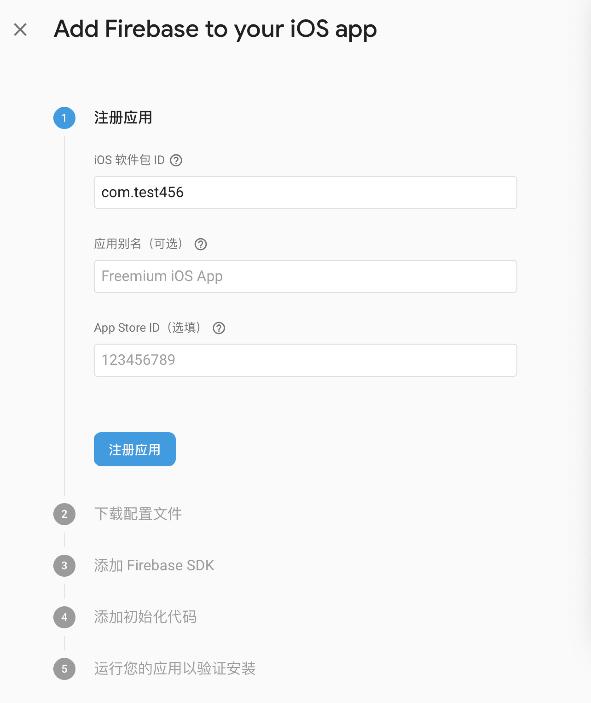
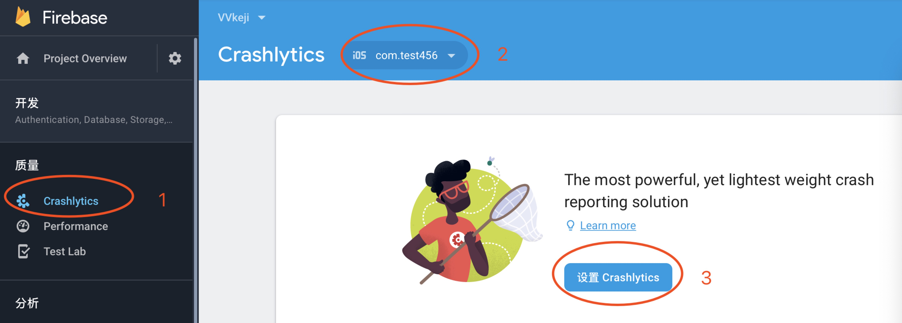
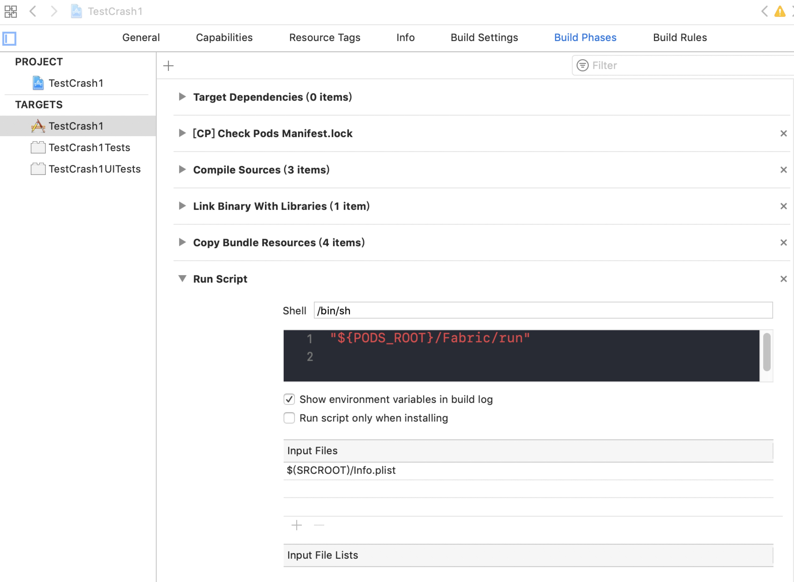

# Firebase Crashlytics 接入流程

海外崩溃收集主要使用Fabric，目前Fabric崩溃收集被迁移到了Firebase平台，原平台暂时还可以用，两者实际使用的都是Crashlytics崩溃收集

+ [Fabric](https://get.fabric.io)

+ [Firebase](https://firebase.google.com)

+ [Crashlytics](http://try.crashlytics.com)

以上三个官网关系如下：Crashlytics->Fabric->Firebase
最终数据都在Firebase上，所以直接使用Firebase里面的Crashlytics来收集崩溃信息

注意：注册Fabric 只能使用Google邮箱账号，打开Firebase需要科学上网

## 流程
+ 登录Firebase->点击开始使用
+ 添加项目
+ 添加应用 填写应用信息软件包ID同APP的Bundle Identifier

添加应用流程完成后，直接编译运行项目，稍等下直到添加应用流程提示添加成功，之后在控制台中就可以看到刚添加的应用

+ 点击Crashlytics 设置

+ Xcode10 设置如下

+ 修改Buidl Settings->Debug Information Format 为 DWARF with dSYM File
+ 编译运行制造崩溃
	+ 添加崩溃代码
	+ 编译运行项目
	+ stop the running scheme or application （停止xcode编译调试）
	+ 打开模拟器或者真机运行崩溃代码
	+ 重新打开应用
+ 成功收集到崩溃信息