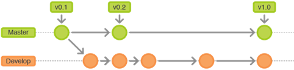
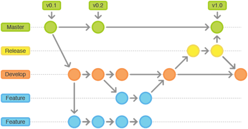
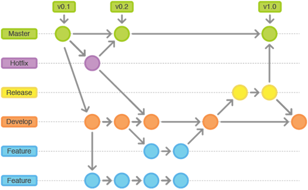

# 代码管理规范

文件编号 | VKKJ-DEV | 版次 | V1.0
------------ | ------------ | ------------ | ------------
发布日期 | 20190220 | 生效日期 | 20190220
编制人 | 冷忆 | 日期 | 20190220
审核人 | 冷忆 | 日期 | 20190220
批准人 | 冷忆 | 日期 | 20190220

### 一、概述：
本文档针对代码版本管理以及代码提交流程，做出了一些规定，便于开发人员有效的管理并归档自己的开发成果，规范公司的代码版本，规范开发，测试和发布流程。

+ 版本管理工具：git
+ 代码管理模型：git flow
+ 客户端管理工具：GitExtensions，TortoiseGit，Sourcetree等等

### 二、 代码分支分类与管理

分支类型 | 操作角色 | 描述
------------ | ------------ | ------------
Master | Master | 唯一官方发布分支，用于记录所有发布历史
Hotfix | Master | 用于维护的分支，唯一一个可以直接基于master创建的分支
Release | QA | 预发布分支，基于develop分支建立的分支，该分支创建，意味着发布周期的开始，上一个研发周期的结束，该分支上不可新增功能，只能修复bug和文档等相关的工作
Develop | Develop | 研发分支，用于记录所有的研发历史记录
Feature | Develop | 研发者本地仓库分支，用于记录不用的功能模块和开发提交过程，功能完成合并到develop之后从中央仓库删除

#### Master 记录发布历史版本
master用于保存官方的发布历史，而develop分支才是用于集成各种功能开发的分支。使用版本号为master上的所有提交打标签（tag）

#### Develop 功能开发分支
一个迭代周期功能开发完毕之后，基于develop分支建立一个用于产品发布的分支（release分支），这个分支版本的建立意味着一个发布周期的开始和一个开发周期的结束，该分支上只能修复bug，做一些文档工作和跟发布相关的工作，不可新增功能。
Release分支作为QA回归测试的版本依据，测试完毕并bug修复完毕后，由master角色员工合并到master分支，并用版本号打上标志，该版本上修复的bug以及提交的内容，必须并入develop分支，在发布周期内，develop分支依然被使用。

#### Hotfix 维护分支
发布分支的维护工作必须在hotfix分支完成，hotfix分支为唯一一个可以直接基于master创建的分支，一旦问题被修复，所有改动必须被合并入master分支和develop分支，在这之前，master正在使用的分支必须打上版本号标签。

### 三、 代码提交工作指南
+ 创建develop分支（开发人员不需要关注此步骤，项目负责人已完成该步骤推送）

