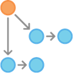
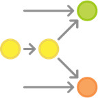
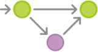

# 代码管理规范

文件编号 | VKKJ-DEV | 版次 | V1.0
------------ | ------------ | ------------ | ------------
发布日期 | 20190220 | 生效日期 | 20190220
编制人 | 冷忆 | 日期 | 20190220
审核人 | 冷忆 | 日期 | 20190220
批准人 | 冷忆 | 日期 | 20190220

### 一、概述：
本文档针对代码版本管理以及代码提交流程，做出了一些规定，便于开发人员有效的管理并归档自己的开发成果，规范公司的代码版本，规范开发，测试和发布流程。

+ 版本管理工具：git
+ 代码管理模型：git flow
+ 客户端管理工具：GitExtensions，TortoiseGit，Sourcetree等等

### 二、 代码分支分类与管理

分支类型 | 操作角色 | 描述
------------ | ------------ | ------------
Master | Master | 唯一官方发布分支，用于记录所有发布历史
Hotfix | Master | 用于维护的分支，唯一一个可以直接基于master创建的分支
Release | QA | 预发布分支，基于develop分支建立的分支，该分支创建，意味着发布周期的开始，上一个研发周期的结束，该分支上不可新增功能，只能修复bug和文档等相关的工作
Develop | Develop | 研发分支，用于记录所有的研发历史记录
Feature | Develop | 研发者本地仓库分支，用于记录不用的功能模块和开发提交过程，功能完成合并到develop之后从中央仓库删除

#### Master 记录发布历史版本
master用于保存官方的发布历史，而develop分支才是用于集成各种功能开发的分支。使用版本号为master上的所有提交打标签（tag）

#### Develop 功能开发分支
一个迭代周期功能开发完毕之后，基于develop分支建立一个用于产品发布的分支（release分支），这个分支版本的建立意味着一个发布周期的开始和一个开发周期的结束，该分支上只能修复bug，做一些文档工作和跟发布相关的工作，不可新增功能。
Release分支作为QA回归测试的版本依据，测试完毕并bug修复完毕后，由master角色员工合并到master分支，并用版本号打上标志，该版本上修复的bug以及提交的内容，必须并入develop分支，在发布周期内，develop分支依然被使用。

#### Hotfix 维护分支
发布分支的维护工作必须在hotfix分支完成，hotfix分支为唯一一个可以直接基于master创建的分支，一旦问题被修复，所有改动必须被合并入master分支和develop分支，在这之前，master正在使用的分支必须打上版本号标签。

### 三、 代码提交工作指南
+ 创建develop分支（开发人员不需要关注此步骤，项目负责人已完成该步骤推送）

　第一步是给默认的master配备一个develop分支。一种简单的做法是：让一个开发者在本地建立一个空的develop分支，然后把它推送到服务器。
git branch develop
git push -u origin develop
 
develop分支将包含项目的所有历史，而master会是一个缩减版本。现在，其他开发者应该克隆（clone）中央仓库，并且为develop创建一个追踪分支。
 
git clone ssh://user@host/path/to/repo.git
git checkout -b develop origin/develop

+ A和B开发新功能

分别开发新功能开始。他们俩各自建立了自己的分支。注意，他们在创建分支时，父分支不能选择master，而要选择develop。
 
git checkout -b some-feature develop

+  A把他的功能开发好了

在提交过几次代码之后，A觉得他的功能做完了，她可以提出一个将她所完成的功能合并入develop分支的请求，她可以自行将她的代码合并入本地的develop分支，然后再推送到中央仓库，团队的代码评审（Code Review），须在此步完成，像这样：

~~~
git pull origin develop
git checkout develop
git merge some-feature
git push
git branch -d some-feature
~~~

第一条命令确保了本地的develop分支拥有最新的代码——这一步必须在将功能代码合并之前做！注意，新开发的功能代码永远不能直接合并入master。必要时，还需要解决在代码合并过程中的冲突。

+ A开始准备一次发布

A创建一个新的release分支来做产品发布的准备工作。在这一步，发布的版本号也最初确定下来。
       git checkout -b release-0.1 develop
　　这个分支专门用于发布前的准备，包括一些清理工作、全面的测试、文档的更新以及任何其他的准备工作。它与用于功能开发的分支相似，不同之处在于它是专为产品发布服务的。
一旦A创建了这个分支并把它推向中央仓库，这次产品发布包含的功能也就固定下来了。任何还处于开发状态的功能只能等待下一个发布周期。

+ A完成了发布

一切准备就绪之后，A就要把发布分支合并入master和develop分支，然后再将发布分支删除。注意，往develop分支的合并是很重要的，因为开发人员可能在发布分支上修复了一些关键的问题，而这些修复对于正在开发中的新功能是有益的。

~~~
git checkout master
git merge release-0.1
git push
git checkout develop
git merge release-0.1
git push
git branch -d release-0.1
~~~

发布分支扮演的角色是功能开发（develop）与官方发布（master）之间的一个缓冲。无论什么时候你把一些东西合并入master，你都应该随即打上合适的标签。

~~~
git tag -a 0.1 -m"Initial public release" master
git push --tags
~~~

+ 用户发现了一个bug

基于master创建了一个用于维护的分支。在这个分支上修复了那个bug，然后把改动的代码直接合并入master

~~~
git checkout -b issue-#001 master
# Fix the bug
git checkout master
git merge issue-#001
git push
~~~

跟用于发布的分支一样，在维护分支上的改动也需要合并入develop分支，这一点是很重要的！因此，务必不能忘了这一步。随后，她就可以将维护分支删除。

~~~
git checkout develop
git merge issue-#001
git push
git branch -d issue-#001
~~~
